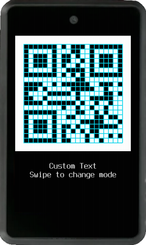

When you export a mnemonic, encrypted mnemonic or a generic text QR code, alternative visualization modes will be available. Swipe left :material-gesture-swipe-left: or right :material-gesture-swipe-right: to change modes, or if your device doesn't have a touchscreen, press the `PAGE` buttons. Find transcribe templates [here](https://github.com/odudex/krux_binaries/tree/main/templates).

### Standard Mode

This mode is optimized for scanning, the raw QR code will be displayed

### Lines Mode

If you are good at transcribing things like handwritten text, with this mode one QR code line will be highlighted at a time. Press `ENTER` to highlight the next line.

### Zoomed Regions Mode

QR codes will be split into regions, of 5x5 or 7x7 "blocks". One QR code region will be shown at a time. Press `ENTER` to display the next region.

### Highlighted Regions Mode

QR codes will be split into regions, of 5x5 or 7x7 "blocks". One QR code region will be highlighted at a time. Press `ENTER` to highlight the next region.

### Grided Mode

Grids will be added to a standard QR code. In a dark room, if you place a sheet of paper over the device's screen, you'll notice QR code will be visible and it will be possible to copy it directly from above (tracing). Be careful not to damage your screen with pen and markers, use an insulating plastic tape or film to protect the device when using this method.

### QR Viewer

Almost every QR code in Krux will also bring up this menu with these extra options: `Toggle Brightness`, `Save QR Image to SD Card` and `Print as QR`. If `Save QR Image to SD Card` shows as disabled it means that the SD card was not detected. To enable `Print as QR` you need to configure your printer driver in [settings](../settings.md#printer).

