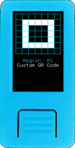
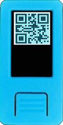
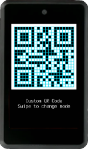

When you export a mnemonic, encrypted mnemonic or a generic text QR code, alternative visualization modes will be available. To change modes swipe sideways, or press `Page` buttons if the device doesn't have touchscreen.

### Standard Mode

This mode is optimized for scanning, the raw QR code will be displayed

### Lines Mode

If you are good at transcribing things like handwritten text, with this mode one QR code line will be highlighted at a time. Press `Enter` to highlight the next line.

### Zoomed Regions Mode

QR codes will be split into regions, of 5x5 or 7x7 "blocks". One QR code region will be shown at a time. Press `Enter` to display the next region.

### Highlighted Regions Mode

QR codes will be split into regions, of 5x5 or 7x7 "blocks". One QR code region will be highlighted at a time. Press `Enter` to highlight the next region.

### Grided Mode

Grids will be added to a standard QR code. In a dark room, if you place a sheet of paper over the device's screen, you'll notice QR code will be visible and it will be possible to copy it directly from above. Be careful to don't damage your screen with pen and markers, use an insulating plastic tape or film to protect the device if you use this method.

