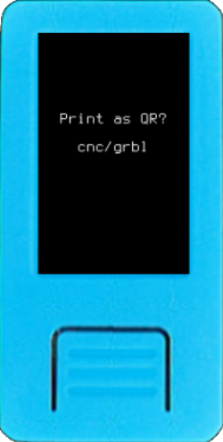

----8<----
warning-printer.en.txt
----8<----

Krux can engrave any QR code (SeedQR, signed PSBT, address, XPUB, wallet output descriptor, ...) on CNC machines (GRBL 1.1) - either via an airgapped SD card file transfer or a direct TTL serial connection.


The video shows a GRBL g-code simulation on [OpenBuilds CONTROL](https://software.openbuilds.com/).
<video width="506" controls>
  <source src="../../../img/CompactSeedQR_CNC.mp4" type="video/mp4"></source>
</video>




After configuring the CNC printer and driver in [settings](../settings.md/#cnc), any screen that displays a QR code will offer the `Print as QR` option. If the driver is configured as *FilePrinter*, the output will be GRBL g-code in a *qr.nc* file on the SD card. If the driver is configured as *GRBLPrinter*, the output will be GRBL g-code sent directly to a GRBL controller via a TTL serial connection. A tested settings is presented below:

```json
"cnc": {
    "unit": "mm",
    "part_size": 70.675,
    "flute_diameter": 3.175,
    "depth_per_pass": 1.0,
    "cut_depth": 2.0,
    "border_padding": 2.0,
    "plunge_rate":300,
    "feed_rate":650,
    "cut_method": "spiral"
}
```

Use this functionality to cut your QRs out of wood or metal:

- Printing QRs backups of your mnemonics and multisig wallet output descriptor.
- Printing your xpubs and receive addresses to share.

<div style="clear: both"></div>


Here is one example of a 96x96mm 2mm drill bit engraved in wood:


Another example of a 50x50mm 2mm drill bit engraved in wood:


----8<----
warning-printed-QR.en.txt
----8<----


