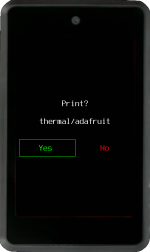

Krux has the ability to print all QR codes it generates, including mnemonic, xpub, wallet backup, and signed PSBT, via a locally-connected thermal printer over its serial port. Consult the [part list](../../parts.md) page for supported printers.

<video width="430" height="300" controls>
  <source src="../../../img/printing-qr.mp4" type="video/mp4"></source>
</video>

<video width="400" height="300" controls>
  <source src="../../../img/scanning-printed-qr.mp4" type="video/mp4"></source>
</video>

Once connected and powered on, all screens that display a QR code will begin showing a follow-up screen asking if you want to `Print to QR?`.

There are many ways you can use this functionality, including:

- Printing backups of your mnemonics and multisig wallets
- Printing your xpubs and receive addresses to share
- Printing signed messages and PSBTs

Since printed thermal paper fades quickly, you can also print your backups on sticker thermal paper to use as templates for punching into more resilient materials like steel.

We also have plans to add support for other kinds of QR "printers" in the future, including CNC machines. In this case, gcode will be generated that can be sent directly to a GRBL controller to cut your QRs out of wood or metal!

Just be careful what you do with the printed codes, since most smartphones can now quickly and easily read QR codes. Treat your QR mnemonic the same way you would treat a plaintext copy of it.

