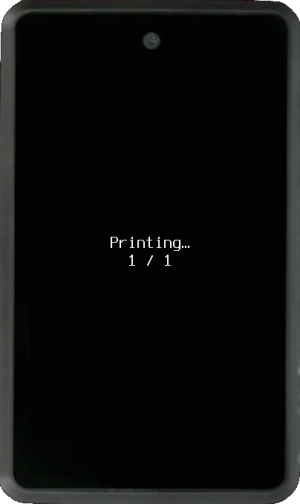

----8<----
warning-printer.en.txt
----8<----

Krux has the ability to print mnemonic backup (Words, Numbers, Tinyseed template; but not Stackbit 1248) and any QR code (SeedQR, signed PSBT, Address, XPUB, Wallet output descriptor, ...) via a locally-connected TTL serial thermal printer. Consult the [parts list](../../parts.md/#optional-ttl-serial-thermal-printer) page for supported printers.

<video width="430" controls>
  <source src="../../../img/printing-qr.mp4" type="video/mp4"></source>
</video>

<video width="400" controls>
  <source src="../../../img/scanning-printed-qr.mp4" type="video/mp4"></source>
</video>

<video width="480" controls>
  <source src="../../../img/printing-scanning-psbt.mp4" type="video/mp4"></source>
</video>

Once a thermal printer and driver have been enabled in [settings](../settings.md/#thermal), all screens that display a QR code will offer the option to `Print as QR`. Other formats of mnemonic backup will also ask if you want to `Print as QR?`. 

There are many ways you can use this functionality, including:

- Printing backups of your mnemonics and multisig wallet output descriptor.
- Printing your xpubs and receive addresses to share.
- Printing signed messages and PSBTs.

Since printed thermal paper fades quickly, you can also print your backups on sticker thermal paper to use as templates for punching into more resilient materials like steel.

----8<----
warning-printed-QR.en.txt
----8<----

