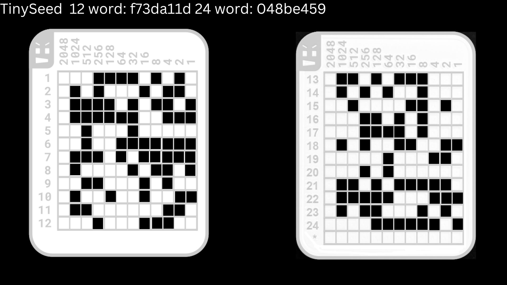
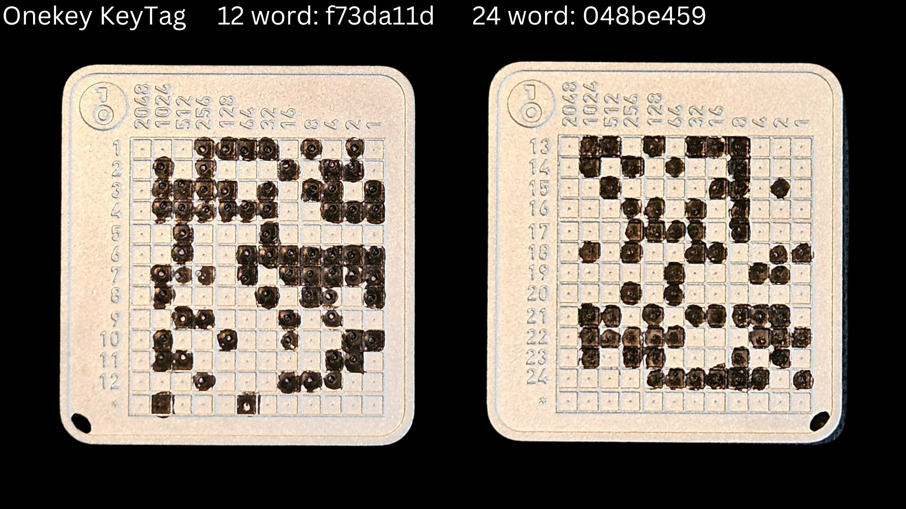
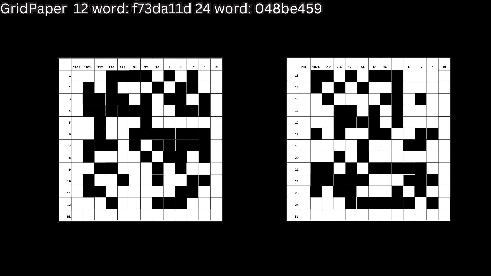
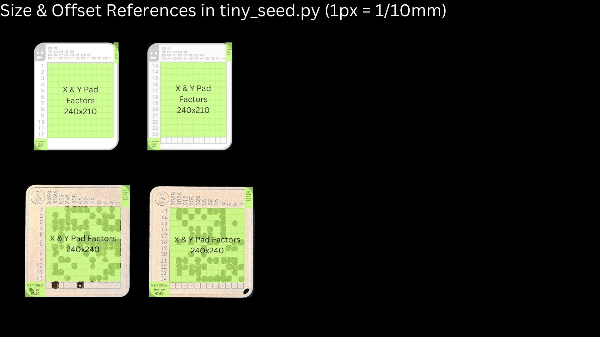

## Background
The examples below have been crated so that you can test the workflow for scanning both 12 and 24 word mnemonics. (Scanning the left plate for a 12 word mnemonic and both plates for 24) The resulting fingerprint from an successful scan is also incldued in the image.

### TinySeed

### OneKey KeyTag

### Binary Grid

## Size, Offset and Padding Reference
If you have a different type of grid that you want to use, you will need to edit the offsets and padding numbers in tiny_seed.py

You can match the pre-sets for supported key-types to the physical dimensions of the tag as shown below.

