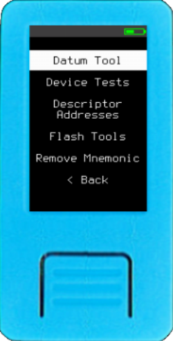
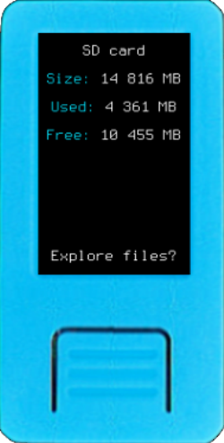
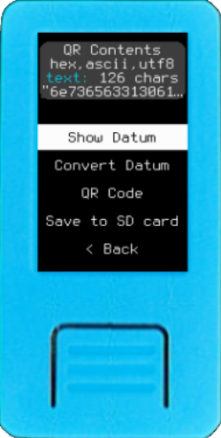
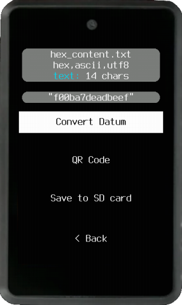
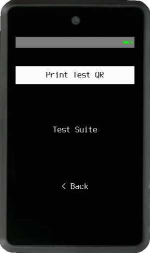
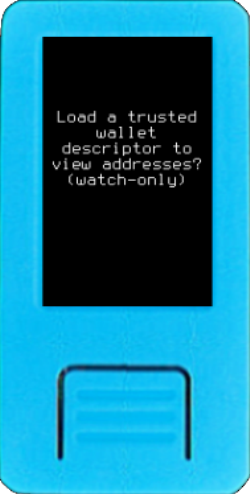
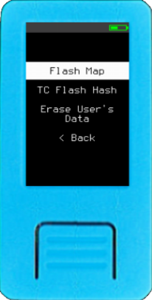

Here are some useful tools that are available as soon as Krux starts! These are offered as a complement to managing your device and wallets.

### Check SD Card

Verify whether your device detects and reads the SD card, and browse its contents. Files can be deleted individually. If there are more files than can fit on a single screen, swipe up :material-gesture-swipe-up: or down :material-gesture-swipe-down: to navigate between the screens - if your device has a touchscreen.

The SD card is optional, but can be used for firmware upgrades and for storing settings, encrypted mnemonics, XPUBs, QR codes, and CNC/files. It is also useful for saving and loading PSBTs, wallet output descriptors, and messages.

### Datum Tool

Datum Tool is an advanced, educational feature that treats all input as a simple *datum*. It provides flexibility for working with QR codes, manually entered text, and files from SD

Once datum has been loaded, it offers meta information about the contents and ability to View Datum -- whether text or binary. It also offers a menu to Convert Datum, Export to QR, and Export to SD.

The Convert Datum menu allows access to common encodings for conversion between bytes and string data. It also offers access to Encrypt contents with full-control to make specific encryption choices. For more info, see [encryption](./encryption/encryption.md).

### Device Tests

Simple tests to verify correct functioning of your Krux device.

#### Print Test QR

Quickly print a test QR code to check and optimize your printer setup.

#### Test Suite

A suite of automated tests to verify important features on your device.

### Descriptor Addresses (Wallet Sans Key)

Verify if an address or list of addresses belong to a wallet without needing to load private keys. Simply load a trusted wallet descriptor from a QR code or SD card.

### Flash Tools

Tools to inspect the content of device's flash memory and clear user's area.

#### Flash Map

Flash map indicates which memory blocks (4086 Bytes each) are empty. Memory is separated in two regions: Firmware and User's Data. White or colored blocks contain data, while grey blocks are empty.

This is an interesting tool to visualize the effects of filling the memory with ramdom entropy, what is done during the setup of a new `TC Code`, used with `TC Flash Hash` tool, described below.

#### TC Flash Hash

*Tamper Check (TC) Flash Hash* is a tamper detection mechanism that enables you to verify if the flash memory content has been altered. To use it first, need to create a *Tamper Check (TC) Code* on **Settings -> Security -> Tamper Check Code**.
*TC Flash Hash* will hash *TC Code*, K210 chip's unique ID and the content of the whole internal flash creating a tamper indicator that is unique to each device, represented by a memorable image and two sets of two words.

More information on [Tamper Detection page](tamper-detection.md).

#### Erase User's Data

This option permanently removes all stored encrypted mnemonics, settings and `TC Code` from the device's internal flash memory. It ensures that the data is irrecoverable, making it an adequate measure to take if any important mnemonics were stored with a [weak encryption key](https://www.hivesystems.com/blog/are-your-passwords-in-the-green).

### Remove Mnemonic

This option allows you to remove any stored encrypted mnemonic from the device's internal memory or an SD card. For more information, see [encryption](./encryption/encryption.md).

When mnemonics are removed from the device's flash memory, Krux will no longer be able to access them. However, as with most operating systems, the data may still be recoverable using specialized tools. If you stored any important keys with a [weak encryption key](https://www.hivesystems.com/blog/are-your-passwords-in-the-green), it is recommended to use the **Flash Tools -> Erase User's Data** feature above to ensure that the data is irrecoverable.

**Note**: When mnemonics are removed from an SD card, Krux will overwrite the region where the encrypted mnemonic was stored with empty data. This makes it more secure to delete mnemonics from SD cards using Krux rather than a PC or another device. However, Krux does not have a "Wipe" feature for SD cards; you can find this feature in third-party applications.

