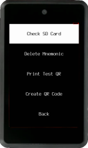
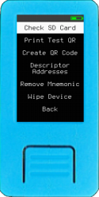
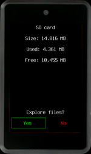
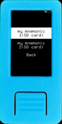
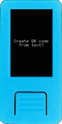

Here are some useful tools that are available as soon as Krux starts! These are offered as a complement to managing your device and wallets.

### Check SD Card

You can check if a SD card can be detected and read by your device and explore its content.

### Delete Mnemonic

Delete any stored encrypted mnemonic, on device's internal memory or SD card.

### Print Test QR

Quickly print a test QR code to check and optimize your printer setup.

### Create QR Code

Enter a text input to create, print or transcript a QR code that can be later used as an encryption key or as a passphrase.

