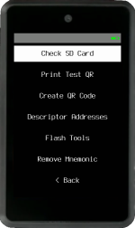
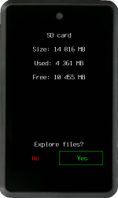
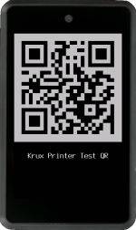
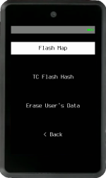
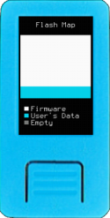

Here are some useful tools that are available as soon as Krux starts! These are offered as a complement to managing your device and wallets.

### Check SD Card

You can check if a SD card can be detected and read by your device and explore its content. If there are too many files to fit on one screen, swipe up :material-gesture-swipe-up: or down :material-gesture-swipe-down: to navigate between the screens if your device has a touchscreen.

### Print Test QR

Quickly print a test QR code to check and optimize your printer setup.

### Create QR Code

Enter text to create, print or transcribe a QR code that can later be used as an encryption key or passphrase. Swipe left :material-gesture-swipe-left: or right :material-gesture-swipe-right: to change modes if your device has a touchscreen.

### Descriptor Addresses

Verify if an address or list of addresses belong to a wallet without needing to load private keys. Simply load a trusted wallet descriptor from a QR code or SD card.

### Flash Tools
Tools to inspect the content of device's flash memory and clear user's area

#### Flash Map
Flash map indicates which memory blocks (4086 Bytes each) are empty. Memory is separated in two regions: Firmware and User's Data. White or colored blocks contain data, while grey blocks are empty.

This is an interesting tool to visualize the effects of filling the memory with ramdom entropy, what is done during the setup of a new `TC Code`, used with `TC Flash Hash` tool, described below.

#### TC Flash Hash
*Tamper Check Flash Hash* is a tamper detection mechanism that enables you to verify if the flash memory content has been altered. To use it first, need to create a `TC Code` on `Settings -> Security -> Tamper Check Code`.
*TC Flash Hash* will hash this code, K210 chip's unique ID and the content of the whole flash memory together and produce an image.
The tool generates a unique image and four tamper detection words based on a hash of your *TC Code*, the device's UID, and the flash content. The flash memory is divided into two regions:

- **Firmware Region:** Generates the image and the first two words.

- **User's Region:** Generates the last two words.

Learn more about *Tamper Check Flash Hash* on [Tamper Detection](tamper-detection.md)

#### Erase User's Data

This option permanently removes all stored encrypted mnemonics, settings and `TC Code` from the device's internal flash memory. It ensures that the data is irrecoverable, making it an adequate measure to take if any important mnemonics were stored with a [weak encryption key](https://www.hivesystems.com/blog/are-your-passwords-in-the-green).

### Remove Mnemonic

This option allows you to remove any stored encrypted mnemonic from the device's internal memory or an SD card. For more information, see [Krux Encrypted Mnemonics](./encrypted-mnemonics.md).

When mnemonics are removed from the device's flash memory, Krux will no longer be able to access them. However, as with most operating systems, the data may still be recoverable using specialized tools. If you stored any important keys with a [weak encryption key](https://www.hivesystems.com/blog/are-your-passwords-in-the-green), it is recommended to use the "Wipe Device" feature below to ensure that the data is irrecoverable.

When mnemonics are removed from an SD card, Krux will overwrite the region where the encrypted mnemonic was stored with empty data. This makes it more secure to delete mnemonics from SD cards using Krux rather than a PC or another device. However, Krux does not have a "Wipe" feature for SD cards; you can find this feature in third-party applications.
