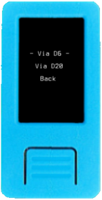
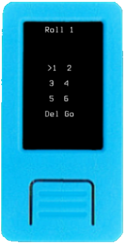
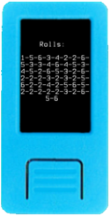

Krux tem suporte para criar mnemônicos de 12 e 24 palavras. Como a verdadeira entropia é difícil de produzir, especialmente com um dispositivo embutido como o M5StickV, o Krux terceiriza a geração de entropia para o usuário.

# Lançamento de dados
Na tela inicial, depois de selecionar 'Novo Mnemônico', você será levado a um segundo menu onde poderá optar por criar um mnemônico por meio de lançamento de um D6 (dado padrão de seis lados) ou D20 (dado de 20 lados). O número de jogadas de dados que você escolhe determina a quantidade de palavras no mnemônico final.

## Através de um D6

A entropia em um único lançamento de um D6 é de 2,585 bits ( log26 ); portanto, 50 lançamentos resultarão em 128 bits de entropia, o suficiente para gerar um mnemônico de 12 palavras. Dobrar a quantidade de lançamentos dobra a entropia para 256 bits, resultando em um mnemônico de 24 palavras.

    

## Através de um D20

Como um D20 tem um maior número de resultados possíveis, a entropia é aumentada, por lançamento, para 4.322 bits ( log220 ). Isso significa que 30 rolagens são suficientes para criar um mnemônico de 12 palavras e 60 rolagens para um mnemônico de 24 palavras.

    

## Como funciona

O Krux acompanha cada lançamento que você insere e exibe a sequência cumulativa de resultados após cada jogada.

    
    

Quando você tiver inserido seu resultado final, o Krux fará o _hash_ dessa string usando o algoritmo _SHA256_ e exibirá o _hash_ resultante na tela para que você possa fazer uma autoverificação.

Em seguida, o Krux utiliza esse _hash_ como argumento do método [`unhexlify`](https://docs.python.org/3/library/binascii.html#binascii.unhexlify) para codificá-lo como _bytes_ e converte o resultado deterministicamente em um mnemônico de acordo com a [Implementação de referência BIP-39](https://github.com/trezor/python-mnemonic/blob/6b7ebdb3624bbcae1a7b3c5485427a5587795120/src/mnemonic/mnemonic.py#L189-L207).

Nota: Para mnemônicos de 12 palavras, apenas a primeira metade do _hash_ SHA256 é usada (128 bits), enquanto os mnemônicos de 24 palavras usam o _hash_ completo (256 bits).

    

# Alternativas
Veja [aqui](https://vault12.rebelmouse.com/seed-phrase-generation-2650084084.html) um bom método para gerar um mnemônico manualmente, ou utilize a página do[Ian Coleman's BIP-39 Tool](https:// iancoleman.io/bip39/) _offline_ ou em um dispositivo sem conexão para gerar uma _seed_ automaticamente.

Vale a pena notar que a ferramenta de Ian é capaz de pegar um mnemônico e gerar um código QR que Krux pode ler através do método de entrada QR mencionado na próxima página.