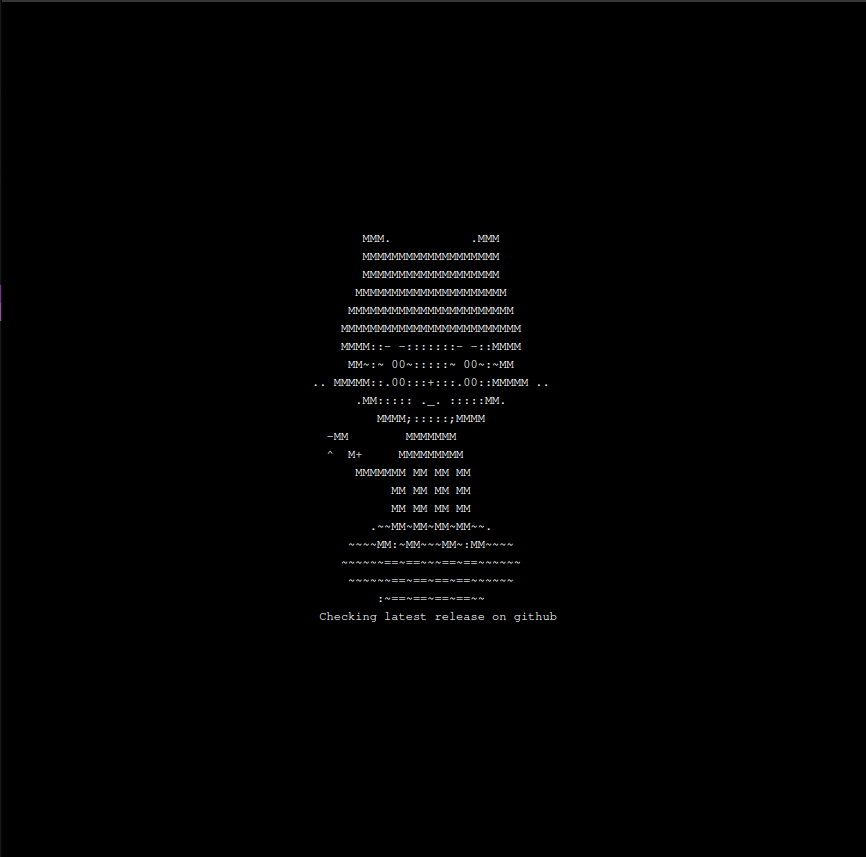
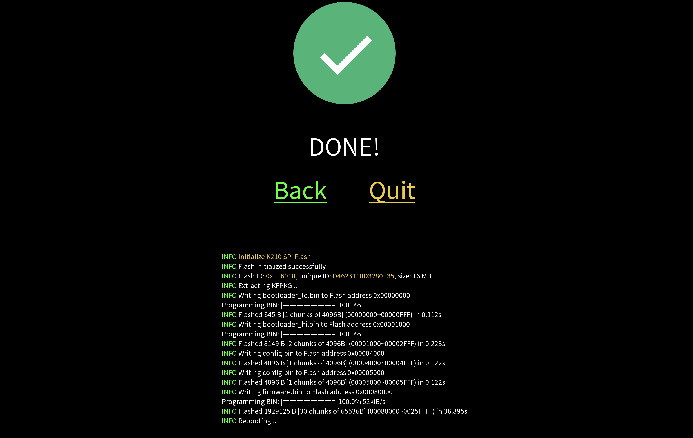

### Installing from a GUI

You can install Krux (both official or beta releases) onto your K210-based device using our
official desktop application, [KruxInstaller](https://github.com/selfcustody/krux-installer),
available for Linux and Windows.

#### Download 

The primary way to download the installer is via
[releases page on Github](https://github.com/selfcustody/krux-installer/releases),

<div>
    
    <br/>
    <em> Figure 1: KruxInstaller download release page</em>
</div>

##### Archlinux users

There is a package named [`krux-installer-bin`](https://aur.archlinux.org/packages/krux-installer-bin)
for Archlinux in the [AUR](https://aur.archlinux.org/). To install `krux-installer-bin`,
you will need to have some [pacman wrapper](https://wiki.archlinux.org/title/AUR_helpers#Pacman_wrappers)

For example:

```bash
🤖 yay -S krux-installer-bin
```

##### Other Linux distros and Windows

We have files for:

| **File**                           | **Operational System**             |
|------------------------------------|:----------------------------------:|
| `krux-installer-0.0.13.AppImage*`  | Any linux distribution             |
| `krux-installer-0.0.13.x86_64.rpm*`| RedHat-based: Fedora, etc...       |
| `krux-installer_0.0.13_amd64.deb*` | Debian-based: Ubuntu, PopOS, etc...| 
| `krux-installer_0.0.13.exe*`       | Windows                            | 


#### Verify files

If you trust the developer, you can skip to [Install](./#install).

> ⚠️  TIP: The verification will help to detect
if any unauthorized modification was made between github
and your local computer. 

##### Integrity

<table>
    <thead>
        <tr>
            <th><strong>System</strong></th>
            <th><strong>Commands</strong></th>
        </tr>
    </thead>
    <tbody>
        <tr>
            <td>Any Linux distribution</td>
            <td>
                ```bash
                🤖 sha256sum --check krux-installer-0.0.13.AppImage.sha256.txt
                ``` 
            </td>
        </tr>
        <tr>
            <td>RedHat-based</td>        
            <td>
                ```bash
                🤖 sha256txt --check ./krux-installer-0.0.13.x86_64.rpm.sha256.txt
                ``` 
            </td>
        </tr>
        <tr>
            <td>Debian-based</td>        
            <td>
                ```bash
                🤖 sha256sum --check ./krux-installer_0.0.13_amd64.sha256.txt
                ``` 
            </td>
        </tr>
        <tr>
            <td>Windows (powershell)</td>        
            <td>
                ```pwsh
                🤖 (Get-FileHash '.\krux-installer_0.0.13.exe').Hash -eq (Get-Content '.\krux-installer_0.0.13.exe.sha256.txt')
                ``` 
            </td>
        </tr>
    </tbody>
</table>
            
##### Authenticity

To do this, you will need have [GPG](https://gnupg.org/) installed.

> ✅ TIP: In Linux systems, it's common to already have it installed by default.


> ⚠️  TIP: In Windows, we recommend install [GPG4Win](https://www.gpg4win.org/).

Once installed, run this command to retrieve the developer's key:

```bash
🤖 gpg --keyserver hkps://keys.openpgp.org --recv-keys B4281DDDFBBD207BFA4113138974C90299326322
```

Then you can verify:

<table>
    <thead>
        <tr>
            <th><strong>System</strong></th>
            <th style="text-align: center;"><strong>Commands</strong></th>
        </tr>
    </thead>
    <tbody>
        <tr>
            <td>Any Linux distribution</td>
            <td>
                ```bash
                🤖 gpg --verify ./krux-installer-0.0.13.AppImage.sig
                ``` 
            </td>
        </tr>
        <tr>
            <td>RedHat-based</td>        
            <td>
                ```bash
                🤖 gpg --verify ./krux-installer-0.0.13.x86_64.rpm.sig
                ``` 
            </td>
        </tr>
        <tr>
            <td>Debian-based</td>        
            <td>
                ```bash
                🤖 gpg --verify ./krux-installer_0.0.13_amd64.deb.sig
                ``` 
            </td>
        </tr>
        <tr>
            <td>Windows (powershell)</td>        
            <td>
                ```pwsh
                🤖 gpg --verify .\krux-installer_0.0.13_exe.sig
                ``` 
            </td>
        </tr>
    </tbody>
</table>


#### Install

Each system require different steps to install:

<table>
    <thead>
        <tr>
            <td><strong>System</strong></td>
            <td style="text-align: center"><strong>Steps</strong></td>
        </tr>
    </thead>
    <tbody>
        <tr>            
            <td>Any Linux distribution</td>
            <td>
                <ul>
                    <li>Place the <code>krux-installer-0.0.13.AppImage</code> where you want;</li>
                    <li>Modify permision to execute: <code>chmod +x krux-installer-0.0.13.AppImage</code>;</li>
                    <li>Run it: <code>./krux-installer-0.0.13.AppImage</code>.</li>
                </ul>
            </td>
        </tr>
        <tr>
            <td>RedHat-based</td>                
            <td>
                <ul>
                    <li>Fedora: <code>sudo  dnf install krux-installer-0.0.13.x86_64.rpm</code>;</li>
                    <li>Other RedHat based distros: <code>sudo yum localinstall krux-installer-0.0.13.x86_64.rpm</code>.</li>
                </ul>
            </td>
        </tr>
        <tr>
            <td>Debian-based</td>
            <td>
                <ul>
                    <li>Install with dpkg: <code>sudo dpkg -i krux-installer_0.0.13_amd64.deb</code>;</li>
                    <li>Update it with apt-get: <code>sudo apt-get install -f</code>.</li>
                </ul>
            </td>             
        </tr>
        <tr>
            <td>Windows</td>
            <td>
                The `krux-installer_0.0.13.exe` is a <a href="https://nsis.sourceforge.io/Main_Page)">NSIS</a> installer.
                The first time you run the `.exe` file the system will ask you to trust the application. The NSIS installer
                will do the rest.
            </td>             
        </tr>
    </tbody>   
</table>

#### Usage

##### Main Menu 
When running Krux Installer, you will be presented with a menu of two items:

<div>
    
    <br/>
    <em>Figure 2: Main menu with two items</em>
</div>


##### Select Device
This is the first step, to select the device we want to flash.

<div>
    
    <br/>
    <em>Figure 3: Select Device Menu with choosen device</em>
</div>

##### Returned to main menu

Now you will be faced with a menu with three items:

<div>
    
    <br/>
    <em>Figure 4: Main menu with three items</em>
</div>

##### Wipe device

This option will give the oportunity to **erase ALL data in device's flash memory**.
It's useful when your device is bricked or as a security approach. To use Krux again, you'll need
to re-flash it. You will be warned (use it on your own risk):

<div>
    
    <br/>
    <em>Figure 5: Wipe warning before execution</em>
</div>

Once selected, the system will prompt for your password. Once typed the `Wipe` process will start and the 
screen will appear to be freeze. Do not touch, unplug or poweroff your device/computer and wait until be done.

<div>
    
    <br/>
    <em>Figure 6: Wipe process running</em>
</div>

Once done, you can scroll down the window to see all events that occured:

<div>
    
    <br/>
    <em>Figure 7: Wipe done</em>
</div>

##### Select version

Once you click `Select version` button, it will always retrieve the latest offical release and the
latest beta release on github.

<div>
    
    <br/>
    <em>Figure 8: Retrieving data from github</em>
</div>

If your connection work, it will show a menu of versions:

<div>
    
    <br/>
    <em>Figure 9: Select version menu</em>
</div>

| **Version** | **Name**                          |**Advantages**                                                                                                                 | **Disavanteges**                                                | 
|-------------|-----------------------------------|-------------------------------------------------------------------------------------------------------------------------------|-----------------------------------------------------------------|
| Official    | `selfcustody/krux/releases/tag/*` |<ul><li>Stable version;</li><li>all features were reviewd and tested;</li><li>It's integrity/authenticity can be verified.</li>| <ul><li>Updates may take some time to be released.</li></ul>    |
| Beta        | `odudex/krux_binaries`            |<ul><li>Constant development by our team;</li><li>Constant UX reviews by our community.</li></ul>                              | <ul><li>Its integrity/authenticity cannot be verified.</li></ul>|


##### Flash

Once we choose the device and firmware, we can flash.

> ⚠️  TIP: You be warned that you must plug and power on your device **before click the flash button**

<div>
    
    <br/>
    <em>Figure 10: Main menu with flash button</em>
</div>


> 🔒 TIP: In linux, you'll be prompted to type your **sudo password**


<div>
    
    <br/>
    <em>Figure 11: Flashing firmware in process</em>
</div>


> ⚠️  TIP: **Do not unplug device before the process is done!**

<div>
    
    <br/>
    <em>Figure 12: Flashing firmware done</em>
</div>

----8<----
flash-krux-logo.md
----8<----

----8<----
amigo-more-info-faq.md
----8<----

### Multilingual support
Prefer a different language? Krux has support for multiple languages. Once at the start screen, go to `Settings`, followed by `Locale`, and select the locale you wish to use.

### Upgrade via microSD card
Once you've installed the initial firmware on your device via USB, you can either continue updating the device by flashing or you can perform upgrades [via microSD](../features/sd-card-update.md) card to keep the device airgapped.
