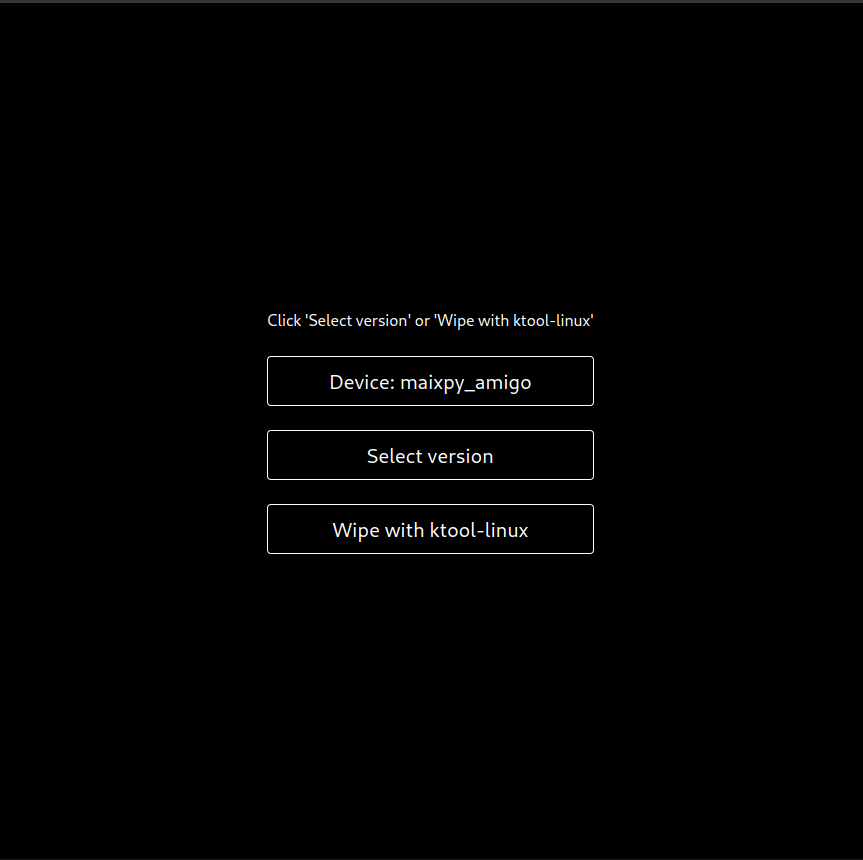

You can install Krux (both official or beta releases) onto your K210-based device using our
official desktop application, [KruxInstaller](https://github.com/selfcustody/krux-installer),
available for Linux and Windows.

### Download 
Download the installer by choosing the right asset for your operating system from our 
[Github releases page](https://github.com/selfcustody/krux-installer/releases):

| **Operational System**                                     | **File**                                   |
|------------------------------------------------------------|:------------------------------------------:|
| Windows                                                    | `{{latest_installer_underline}}.exe`       |
| Debian-based: Ubuntu, PopOS, etc...                        | `{{latest_installer_underline}}_amd64.deb` | 
| RedHat-based: Fedora, etc...                               | `{{latest_installer}}.x86_64.rpm`          |
| Any linux distribution                                     | `{{latest_installer}}.AppImage`            |
| Package for Archlinux on [AUR](https://aur.archlinux.org/).| `krux-installer-bin`                       |

### Verify files
If you trust the project developers, you can skip to [install](#install):

> ⚠️  TIP: This step helps detect if any unauthorized modifications were made between github and your local computer.

#### Integrity
<table>
    <thead>
        <tr>
            <th><strong>System</strong></th>
            <th><strong>Commands</strong></th>
        </tr>
    </thead>
    <tbody>
        <tr>
            <td>Windows (powershell)</td>        
            <td>
                ```pwsh
                # Compare this output:
                (Get-FileHash '{{latest_installer_underline}}.exe').Hash
                
                # With this:
                Get-Content '{{latest_installer_underline}}.exe.sha256.txt'
                ``` 
            </td>
        </tr>
        <tr>
            <td>Debian-based</td>        
            <td>
                ```bash
                sha256sum --check ./{{latest_installer_underline}}_amd64.deb.sha256.txt
                ``` 
            </td>
        </tr>
        <tr>
            <td>RedHat-based</td>        
            <td>
                ```bash
                sha256txt --check ./{{latest_installer}}.x86_64.rpm.sha256.txt
                ``` 
            </td>
        </tr>
        <tr>
            <td>Any Linux distribution</td>
            <td>
                ```bash
                sha256sum --check ./{{latest_installer}}.AppImage.sha256.txt
                ``` 
            </td>
        </tr>
    </tbody>
</table>
            
#### Authenticity
You will need have [GPG](https://gnupg.org/) installed. Most Linux already have this, but on Windows we recommend installing [GPG4Win](https://www.gpg4win.org/).

Once installed, run this command to retrieve the developer's key:

```bash
gpg --keyserver hkps://keys.openpgp.org --recv-keys B4281DDDFBBD207BFA4113138974C90299326322
```

Then you can verify:

| System                 | Command                                               |
|------------------------|-------------------------------------------------------|
| Windows (powershell)   | `gpg --verify {{latest_installer_underline}}.exe.sig`          |
| Debian-based           | `gpg --verify ./{{latest_installer_underline}}_amd64.deb.sig`  |
| RedHat-based           | `gpg --verify ./{{latest_installer}}.x86_64.rpm.sig` |
| Any Linux distribution | `gpg --verify ./{{latest_installer}}.AppImage.sig`   |

> ⚠️  TIP: If the verification was successful, you may get a message similar to: `Good signature from "qlrddev <qlrddev@gmail.com>"`

### Install
Each system require different steps to install:

<table>
    <thead>
        <tr>
            <td><strong>System</strong></td>
            <td style="text-align: center"><strong>Steps</strong></td>
        </tr>
    </thead>
    <tbody>
        <tr>
            <td>Windows</td>
            <td>
                <ul>
                    <li>The <code>{{latest_installer_underline}}.exe</code> is a <a href="https://nsis.sourceforge.io/Main_Page">NSIS</a> installer;</li>
                    <li>The first time you run the <code>.exe</code> file the system will ask you to trust the application;</li>
                    <li>See <a href="/krux/getting-started/installing/from-gui/#windows">windows section below</a> for more information</li>
            </td>             
        </tr>
        <tr>
            <td>Debian-based</td>
            <td>
                <ul>
                    <li>Install with dpkg: <code>sudo dpkg -i {{latest_installer_underline}}_amd64.deb</code>;</li>
                    <li>Update it with apt-get: <code>sudo apt-get install -f {{latest_installer_underline}}_amd64.deb</code>.</li>
                </ul>
            </td>             
        </tr>
        <tr>
            <td>RedHat-based</td>                
            <td>
                <ul>
                    <li>Fedora: <code>sudo  dnf install {{latest_installer}}.x86_64.rpm</code>;</li>
                    <li>Other RedHat based distros: <code>sudo yum localinstall {{latest_installer}}.x86_64.rpm</code>.</li>
                </ul>
            </td>
        </tr>
        <tr>            
            <td>Any Linux distribution</td>
            <td>
                <ul>
                    <li>Place the <code>{{latest_installer}}.AppImage</code> where you want;</li>
                    <li>Modify permision to execute: <code>chmod +x {{latest_installer}}.AppImage</code>;</li>
                    <li>Run it: <code>./{{latest_installer}}.AppImage</code>.</li>
                </ul>
            </td>
        </tr>
    </tbody>   
</table>

#### Windows
On Windows, you'll be faced with a blue window saying "Windows protected your PC". This occurs because
we don't have a [code signing certificate](https://signmycode.com/resources/how-to-sign-an-exe-or-windows-application),
Click on "More info" and allow the execution. Follow the installer's instructions to complete the installation.

> 🛡️  TIP: If you followed the steps presented in [authenticity](#authenticity), you already 
have the assurance that the software is from a verified and genuine software publisher


### Usage

#### Main Menu 
When executing the Krux Installer, you will be presented with a menu of two items:


#### Select Device
First, select the device we want to flash. After that the menu will shown three items:




#### Select Version
This option allows you to select the latest official version or the latest beta version on our github. If the connection works, you will see the following screen:


| **Version** | **Name**                           |**Advantages**                                                                                                                     | **Disadvantages**                                                | 
|-------------|------------------------------------|-----------------------------------------------------------------------------------------------------------------------------------|-----------------------------------------------------------------|
| Official    | `selfcustody/krux/releases/tag/* `  |<ul><li>Stable version;</li><li>All features were reviewd and tested;</li><li>It's integrity and authenticity can be verified.</li>| <ul><li>Updates may take some time to be released.</li></ul>    |
| Beta        | `odudex/krux_binaries`             |<ul><li>Latest features available;</li><li>Constant UX reviews by our community.</li></ul>                                         | <ul><li>Its integrity or authenticity cannot be verified.</li></ul>|


#### Flash

Once you choose the device and version, it enables the "flash with ktool" button.

> ⚠️  TIP: You must connect and turn on your device **before flashing**.
In Linux, you'll be prompted to type your **password** (sudo or admin).
**Do not disconnect the device until the process is complete!**


----8<----
flash-krux-logo.en.txt
----8<----

#### Wipe device

This option **erases ALL data from the device's flash memory**. On Linux, it will prompt for your password before. Once the process starts, the screen will appear frozen. When it's done, you can scroll down and see all the events that occurred.

> ⚠️  TIP: It's useful when your device is not working or for security reasons. To use Krux again, you'll need to re-flash the firmware.


> ⚠️  TIP: Do not unplug or poweroff your device or computer. Wait until the process finishes.

----8<----
tips-after-install.en.txt
----8<----
