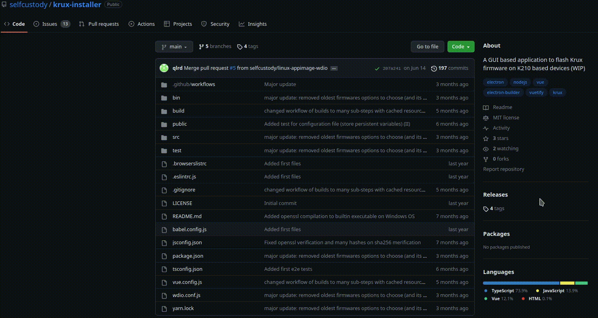
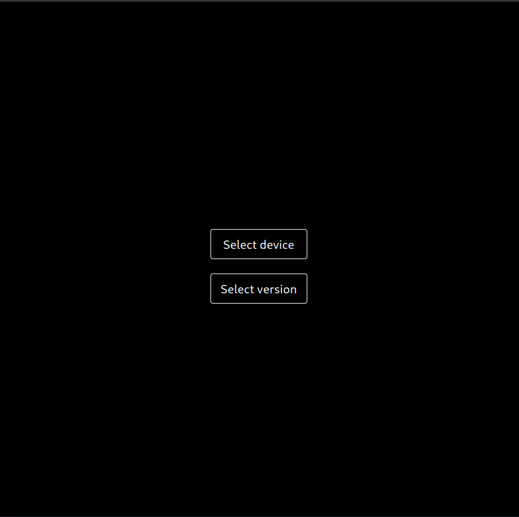
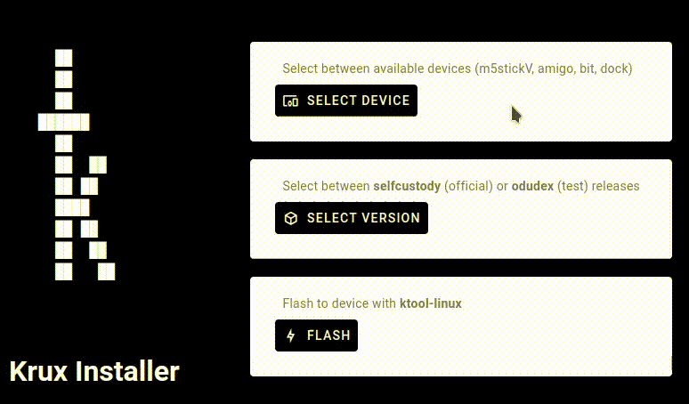
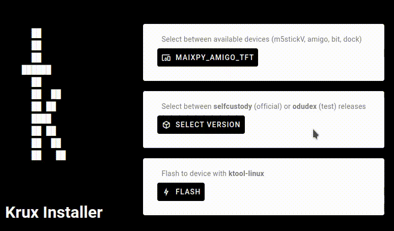
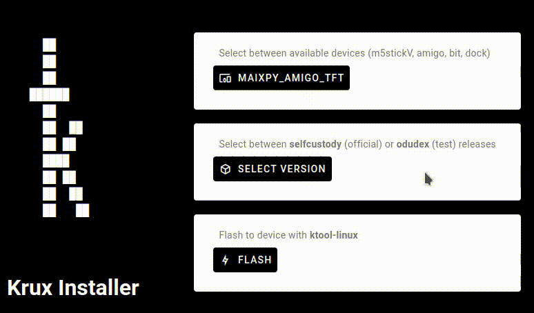
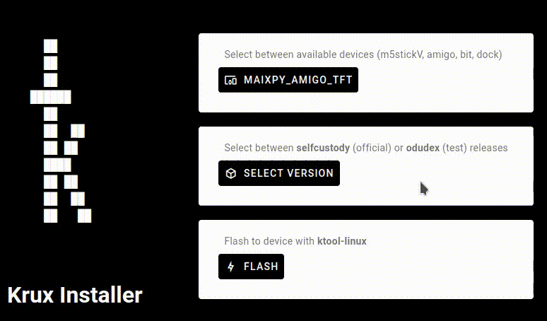

This page explains how to install Krux with KruxInstaller (GUI).

### Installing from a GUI

You can install krux onto your K210-based device using our official desktop application, which we named [KruxInstaller](https://github.com/selfcustody/krux-installer), available for Linux and Windows.

Under the hood the GUI uses the same methods described in [Installing from pre-build release](../installing/index.en.md), i.e. download, verify and flash the latest official release, but user won't need to type any command. Additionally you can install, through this application, [experimental compiled Krux binaries](https://github.com/odudex/krux_binaries).

Keep in mind that this is software under development in the alpha stage and may be buggy. If you find any bugs or want to contribute to the project, please go to [issues](https://github.com/selfcustody/krux-installer/issues) or [fork it](https://github.com/selfcustody/krux-installer/fork).

### Requirements
#### Hardware
You will need a K210-based device such as the M5StickV, Maix Amigo, Maix Dock, or Maix Bit and a USB-C cable to continue. Consult the [part list](../../parts.md) for more information.

#### Download the latest release

The primary way to download the binary is via [releases](https://github.com/selfcustody/krux-installer/releases) page on Github, search for `Assets` and click the dropdown arrow:



##### Archlinux users

There is a package named [`krux-installer-bin`](https://aur.archlinux.org/packages/krux-installer-bin) for Archlinux in the [AUR](https://aur.archlinux.org/). To install `krux-installer-bin`, You need to have the [yay](https://github.com/Jguer/yay) package manager installed. Then run on your terminal:

```bash
yay -Sy krux-installer-bin
```

#### Verify the files
Before installing the release, it's a good idea to check if the hash sum matches the one defined in the file `*.sha256.txt`:

##### On Linux

```bash
sha256sum --check KruxInstaller-0.0.1-alpha-4.AppImage.sha256.txt KruxInstaller-0.0.1-alpha-4.AppImage
```

##### On Windows with `powershell`

```pwsh
(Get-FileHash '.\KruxInstaller.Setup.0.0.1-alpha-4.exe').Hash -eq (Get-Content '.\KruxInstaller.Setup.0.0.1-alpha-4.exe.sha256.txt')
```

#### Modify permissions

If you use Linux, you will need to add permission to allow execution of the `.AppImage` file:

```bash
chown +x ./KruxInstaller-0.0.1-alpha-4.AppImage
```

If you use Windows, the first time you run the `.exe` file the system will ask you if you trust the application.

### Openssl

When downloading official krux firmware versions, it is necessary to verify the signature through the OpenSSL tool, as a way to verify the authenticity of the downloaded binaries.

On linux release, verification is easily done since such tool exists natively in operating system. In windows release we are faced with the peculiarity of the operating system in question not having such a tool (see this [comment](https://github.com/selfcustody/krux-installer/issues/2#issuecomment-1361172849)*).

So, we packaged a stable version of OpenSSL, compiled from the source. The compilation process is done entirely in a virtual environment on github and it is expected to be fully verifiable and free of malicious code. You can check the build steps in [github actions](https://github.com/selfcustody/krux-installer/actions).

`*fun fact: with this comment we can learn a bit about a part of krux development in its early stages.`


### Usage

When running Krux Installer, you will be presented with a menu of three items:

- Select device;
- Select version;
- Flash;



#### Select device

As the name says, here we select which device we want to flash; we recommend starting with this item.

The window features three things: a dropdown arrow, a select button, and a back button.

Clicking on the dropdown arrow brings up a list of officially supported K210 devices. By clicking on one of them we will be selecting a different firmware flavor that we will still choose. Then we can click on the select button.



#### Select version

Now we will select which firmware we want to flash, i.e. the [latest official release](https://github.com/selfcustody/krux/releases) or the [test binaries](https://github.com/odudex/krux_binaries). 

The difference between the two releases is that, while in the first one we can [verify its integrity and authenticity](from-pre-built-release.md/#verify-the-files), in the second one we will have no means of verifying it. However, the test binaries will contain the newest features that are being developed and discussed by the kruxer community.


##### Official release

The software will display the latest officially released version in the form `selfcustody/tags/vXX.YY.Z`, where XX means the year of release, YY the month of release and Z a subversion of this release.

Once selected, the application will check if the entry exists in the system. If not, it will download the following files: `krux-vXX.YY.Z.zip`, `krux-vXX.YY.Z.zip.sha256.txt`, `krux-vXX.YY.Z.zip .sig` and `selfcustody.pem`.

- `krux-vXX.YY.Z.zip`: contains all the necessary binaries and signature files to install the firmware on each of the supported K210 devices;

- `krux-vXX.YY.Z.zip.sha256.txt`: contains a hash to verify the integrity of the downloaded `zip` file;

- `krux.vXX.YY.Z.zip.sig`: is the public digital signature for authenticity verification of the downloaded `zip` file;

- `selfcustody.pem`: is the public digital certificate that attests to the veracity of the public digital signature.


If they are already present on your computer, the application will give you the option to download them again or continue with the files already downloaded.



##### Test binaries

As the name suggests, these binaries are intended for test purposes, contain experimental features, and are more likely to contain bugs. Use with caution.

`KruxInstaller` will present the latest tested version released in the form `odudex/krux_binaries`, so you will always be given the option to download the latest commit from its repository.


- `<device>/firmware.bin`: is the unsigned firmware's binary of the choosen device;
- `<device>/kboot.kfpkg`: is the unsigned and compressed bootloader of the choosen device;
- `<device>/ktool-<os>`: is the k210 tool "flasher" specific to Operational system:
    - `ktool-linux`: for linux machines;
    - `ktool-win.exe`: for windows machines;

If they are already present on your computer, the application will give you the option to download them again or continue with the files already downloaded.



#### Flash

Once we choose the device and firmware, we can flash. Before start the flash process itself, you be warned that you must plug and power on your device (for m5stickV and amigo devices); if you are using dock or bit devices, maybe the device itself will power on.


