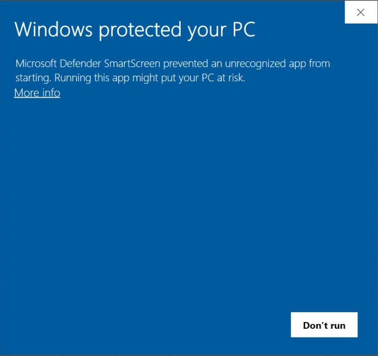

# :material-microsoft-windows: Download assets
 
* [`{{latest_installer_win}}`](https://github.com/selfcustody/krux-installer/releases/download/{{latest_installer}}/{{latest_installer_win}})

## Install

Execute the `{{latest_installer_win}}`. You'll be faced with a blue window saying
"Windows protected your PC". This occurs because we don't have a
[code signing certificate](https://signmycode.com/resources/how-to-sign-an-exe-or-windows-application):

----8<----
verify-the-signature-trust-tip.en.txt
----8<----

Follow the installer's instructions to complete the installation. At the end, click on 
"Create desktop icon":

## After install

----8<----
after-install-installer.en.txt
----8<----
