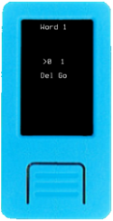

Once you have either a 12- or 24-word mnemonic, choose `Load Mnemonic` on Krux's start menu, and you will be presented with several input methods:

## Input Methods
### Via Text

Enter each word of your BIP-39 mnemonic one at a time. Krux will disable impossible-to-reach letters as you type and will attempt to autocomplete your words to speed up the process.

On your 12th or 24th word, you can leave the word blank to have Krux generate the final word of your mnemonic for you. This is handy if you chose a manual method to generate your mnemonic and want the final word to be a valid checksum.

 

### Via Numbers

Enter each word of your BIP-39 mnemonic as a number from 1 to 2048 one at a time. You can use [this list](https://github.com/bitcoin/bips/blob/master/bip-0039/english.txt) for reference.

On your 12th or 24th word, you can leave the word blank to have Krux generate the final word of your mnemonic for you. This is handy if you chose a manual method to generate your mnemonic and want the final word to be a valid checksum.

 

### Via Bits

Enter each word of your BIP-39 mnemonic as a [bitstring](https://github.com/hatgit/BIP39-wordlist-printable-en/blob/master/BIP39-en-printable.txt) one at a time. To speed up input, leading 0s are optional.

On your 12th or 24th word, you can leave the word blank to have Krux generate the final word of your mnemonic for you. This is handy if you chose a manual method to generate your mnemonic and want the final word to be a valid checksum.

    

### Via QR

It's unpleasant having to manually enter 12 or 24 words each time you want to use Krux. To remedy this you can instead use the device's camera to read a QR code containing the words (encoded as a single space-separated text string). You can either use [an offline QR code generator for this](https://iancoleman.io/bip39/) (ideally on an airgapped device), or you can attach a thermal printer to your Krux and print out the mnemonic after opening your wallet via one of the manual methods first. Check out the [Printing section](../printing) for more information.

    

Once you have entered your mnemonic, you will be presented with the full list of words to confirm.

## Single-key or Multisig

After loading your mnemonic, you will be brought to a small menu asking if you want to use it as part of a `Single-key` or `Multisig` wallet.

Your choice here will subtly change the generated xpub that is used to set up your device in your wallet coordinator software. You can learn more about the difference in the following guides for using [single-key](../using-a-single-key-wallet) and [multisig](../using-a-multisig-wallet) wallets.

Now, onto the main menu...