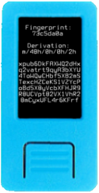
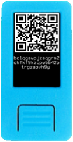
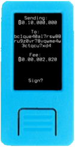

After entering your mnemonic, you will find yourself on Krux's main menu.

Below is a breakdown of the options:

### Mnemonic

This option allows you to view your mnemonic words and, if you have a thermal printer attached, print out the mnemonic as a QR code. The data in this code will be a plaintext space-separated string of the (English) words. This QR code can then be read by Krux for faster loads in the future.

    

### Extended Public Key

This option displays your master extended public key (xpub) as text as well as a QR code.

After the xpub, a zpub or Zpub is shown depending on if a single-key or multisig wallet was chosen. This z/Zpub is usually not necessary unless you are using a wallet coordinator that either cannot parse or ignores [key origin information in key expressions](https://github.com/bitcoin/bips/blob/master/bip-0380.mediawiki#Key_Expressions).

If a thermal printer is attached, you can print both QR codes.

 

### Wallet

When you first select this option, you will be prompted to load a wallet. At this point, the camera will turn on and you will need to scan a wallet backup QR code from your wallet coordinator software. If scanned successfully, you will see a preview of the wallet to confirm.

If you return to this option after having loaded your wallet, you will see the wallet's name and the (abbreviated) xpubs of all cosigners along with a QR code containing the same exact data that was loaded. If you have a thermal printer attached, you can print this QR code.  

Note that you currently can't change the wallet once one has been loaded. To do this, you will need to restart the device and re-enter your mnemonic.

 

### Scan Address

This option turns on the camera and allows you to scan in a QR code of a receive address. Upon scanning, it will render its own QR code of the address back to the display along with the (text) address below it. You could use this feature to scan the address of someone you want to send coins to and display the QR back to your wallet coordinator rather than copy-pasting an address.

If you have a thermal printer attached, you can also print this QR code. 

After proceeding through this screen, you will be asked if you want to check that the address belongs to your wallet. If you confirm, it will exhaustively search through as many addresses derived from your wallet as you want in order to find a match.

This option exists as an extra security check to verify that the address your wallet coordinator has generated is authentic and belongs to your wallet.

 

### Sign

Under *Sign*, you can choose to sign a PSBT or a message (sha256 hash).

#### PSBT

This option turns on the camera and allows you to scan an animated QR code of a PSBT generated by your wallet coordinator software. Upon scanning, you will be shown a preview of how much BTC is being sent, who is receiving it, and the fee that is being paid. Amounts are displayed in [Satcomma standard format](https://medium.com/coinmonks/the-satcomma-standard-89f1e7c2aede).

If you confirm, a signed PSBT will be generated and an animated QR code will be displayed that you can use to import the signed PSBT back into your wallet coordinator software. If a thermal printer is attached, you can also print the QR codes.

 

#### Message

This option turns on the camera and allows you to scan a QR code of a message or the sha256 hash of one. Upon scanning, you will be shown a preview of the message's sha256 hash to confirm before signing.

If you confirm, a signature will be generated and you will see a base64-encoded version of it followed by a QR code of it. If a thermal printer is attached, you can also print the QR code.

Proceeding that, you will see your raw (master) public key in hexadecimal form, followed by a QR code of it, that can be used by others to verify your signature. If a thermal printer is attached, you can also print the QR code.