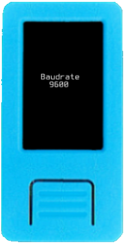
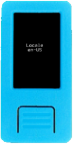

On Krux's start menu, there is a *Settings* option.

Below is a breakdown of the settings you can change:

### Network

This option allows you to switch between `mainnet` (the default) and `testnet`. This is mostly useful for development. 

     

### Printer

Printers can come with different baudrates from the manufacturer. By default, Krux assumes the connected printer will have a baudrate of `9600`. If yours is different, you can change this here.

     

### Locale

Here you can change the language that Krux uses. Note that in order to change the locale you must have a microSD card with a `translations` folder containing translation files inserted into the device.

     

### Debug

Krux is capable of logging out information as it runs to a `.krux.log` file on the root of an inserted microSD card. **By default, it logs nothing**.

Unless you are running into a bug and trying to get more information to diagnose the problem, it is **strongly recommended** to leave the *Log Level* here as *NONE*.

If you experience an error and want to see more information about it, including a stack trace, you can change the *Log Level* to *ERROR*. If you're developing and want to see _everything_, you can change *Log Level* to either *INFO* or *DEBUG*.

Note that *DEBUG* could inadvertently write your private keys to the log file if you have it enabled when entering your mnemonic, so set it with care. To help prevent an accident like this from happening, Krux will display **DEBUG** on the start screen as a reminder when this is set.