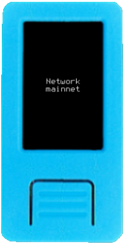
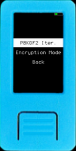
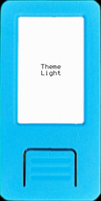

In the Krux home menu, there is a `Settings` entry. Below is a breakdown of the options you can change:

### Bitcoin - Network

This option allows you to switch between `mainnet` (the default) and `testnet`. This is mostly useful for development. 

### Encryption

Modify the encryption method and parameters to fit your needs. The encryption settings will be used both to store mnemonics and create encrypted QR codes.

#### PBKDF2 Iter. (Iterations)

When you enter a encryption key it is not directly used to encrypt your data. As a feature to increase safety, specially against brute force attacks, the key is derived multiple times using hashing functions. PBKDF2(Password-Based Key Derivation Function) iterations stands for the amount of derivations that will be performed over your key prior to encrypt/decrypt your mnemonic.

If you increase this value it will make the encryption harder, at the cost of taking longer to encrypt and decrypt your mnemonics

Values must be multiple of 10,000. This was done to save data space on QR codes, also, intermediary values wouldn't significantly affect safety or computation time.

#### Encryption Mode

Choose between well known and widely used AES(Advanced Encryption Standard) modes:

##### AES-ECB

ECB(Electronic Codebook), its a simpler method where encryption data blocks are encrypted individually. It will be faster and simpler to encrypt, QR codes will have a lower density and will be easier to transcribe.

##### AES-CBC

CBC(Cipher-block Chaining) is considered safer, because at the first data block an initial vector(IV) is used to add random data to the encryption. Subsequent blocks encryption depend on data from the previous blocks, giving its chaining feature.
It will take longer to encrypt, because a snapshot will be required to generate a random initial vector. This initial vector will be stored together with encrypted data, making encrypted QR codes denser and harder to transcript.

### Language - Locale

Here you can change the language that Krux uses.

### Logging

Krux is capable of logging out information as it runs to a `.krux.log` file on the root of an inserted microSD card. **By default, it logs nothing**.

Unless you are running into a bug and trying to get more information to diagnose the problem, it is **strongly recommended** to leave the *Log Level* here as *NONE*.

If you experience an error and want to see more information about it, including a stack trace, you can change the *Log Level* to *ERROR*. If you're developing and want to see _everything_, you can change *Log Level* to either *INFO* or *DEBUG*.

Note that *DEBUG* could inadvertently write your private keys to the log file if you have it enabled when entering your mnemonic, so set it with care. To help prevent an accident like this from happening, Krux will display a colored rectangle on the upper left corner of the screen, of which the color is relative to the logging level, being green the DEBUG color.

### Persist

Choose between flash(device's internal memory) or SD card for the place where your settings will be stored.

### Printer

You can set up a thermal printer or tell Krux to store a GRBL CNC instructions file on a SD card to machine QR codes

#### CNC

Define several machining parameters according to the desired size, material you'll use, and your CNC characteristics and capabilities.

#### Thermal

Printers can come with different baudrates from the manufacturer. By default, Krux assumes the connected printer will have a baudrate of `9600`. If yours is different, you can change this here.
Also setup the IOs you'll use and tweak parameters according to your printer recommendations.

#### Driver

Here you choose between Thermal, CNC or none(default). Leave this setting to "none" if you won't use a printer and don't want to be bothered by print prompts.

### Theme

Choose your color theme according to your preference. Some themes may be more suitable for some devices, coordinator cameras and environments. As an example, it may be easier to scan QR codes from Krux devices using light theme in brighter environments.

### Touchscreen

If your device has touchscreen you can change the touch detection threshold. If it is being too sensitive or detecting false (ghost) touches, you should increase the threshold value, making it less sensitive. The other way is also valid, reduce the threshold to make the screen more sensitive to touches.

### Encoder

If your device has a rotary encoder, you can change the debounce threshold in milliseconds. With lower values, faster movements and navigation will be allowed.

The caveat is low values can cause issues, such as double step and unexpected movements, especially with lower quality encoders. If this is the case increase the value to make navigation more stable.

