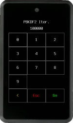
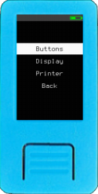
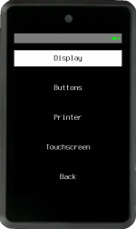
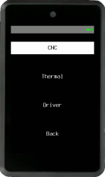
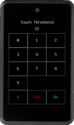
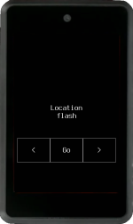
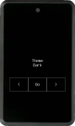
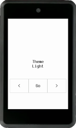

In the Krux home menu, there is a `Settings` entry. Some submenu entries have too many options to fit on one screen, swipe up :material-gesture-swipe-up: or down :material-gesture-swipe-down: to navigate between the screens if your device has a touchscreen. Below is a breakdown of the options you can change:

### Default Wallet

Set the default attributes for wallet loading.

#### Multisig

Set this to true if you are more likely to use Krux for multisig setups. This way, you won't need to "Customize" your wallet attributes every time you load a key.

#### Network

This option allows you to switch between `mainnet` (the default) and `testnet`. `Testnet` can be used to try out different wallet coordinators or for development. 

### Encryption

Modify the encryption method and parameters to fit your needs. This will be used when storing encrypted mnemonics or creating encrypted QR codes. For more info see [Krux Encrypted Mnemonics](./features/encrypted-mnemonics.md).

#### PBKDF2 Iter. (Iterations)

When you enter the encryption key, it is not directly used to encrypt your data. In order to protect against brute force attacks, the key is derived multiple times using hashing functions. PBKDF2 (Password-Based Key Derivation Function) iterations stands for the amount of derivations that will be performed over your key prior to encrypt/decrypt your mnemonic.

If you increase this value it will make the encryption harder, at the cost of taking longer to encrypt/decrypt your mnemonics.

Values must be multiple of 10,000. This was done to save data space on QR codes.

#### Encryption Mode

Choose between well known and widely used AES (Advanced Encryption Standard) modes:

##### AES-ECB
ECB (Electronic Codebook) is a simpler method where data blocks are encrypted individually. Compared to CBC, it will be faster and simpler to encrypt, QR codes will have a lower density and will be easier to transcribe.

##### AES-CBC
CBC (Cipher-block Chaining) is considered more secure than ECB.  The first data block, an initialization vector (IV), is used to add random data to the encryption. The encryption of subsequent blocks depends on the data from previous blocks, ensuring chaining.

Encryption will take longer because a snapshot will be needed to generate the IV. This IV will be stored together with the encrypted data, making encrypted QR codes denser and harder to transcribe.

### Hardware

Customize the parameters available for your device and change printer settings.

#### Encoder (Maix Dock only)
If your device has a rotary encoder, you can change the debounce threshold in milliseconds. With lower values, faster movements and navigation will be allowed.

The caveat is low values can cause issues, such as double step and unexpected movements, especially with lower quality encoders. If this is the case increase the value to make navigation more stable.

#### Display (Maix Amigo only)

Some Maix Amigo screens are different, here you can customize the `BGR Colors`, `Flipped X Coordinates`, `Inverted Colors` and `LCD Type`. For more info see [Troubleshooting](../troubleshooting.md/#troubleshooting-lcd-settings-on-maix-amigo)

### Printer

You can set up a TTL serial thermal printer or tell Krux to store a GRBL CNC instructions file on a SD card to machine QR codes.

#### CNC
Define several machining parameters according to the desired size, material you'll use, and your CNC characteristics and capabilities.

#### Thermal
Printers can come with different baudrates from the manufacturer. By default, Krux assumes the connected printer will have a baudrate of `9600`. If yours is different, you can change it here.

Also setup the TX Pin you'll use (e.g. 35 for M5StickV and 7 for Maix Amigo) and tweak other parameters according to your printer recommendations. For most printers you will only need to connect 2 cables, the device TX to the printer RX and ground. Current uses of printing are listed [here](features/printing.md). Consult the [parts list](../parts.md/#optional-ttl-serial-thermal-printer) for supported printers.

#### Driver
Here you choose between Thermal, CNC or none (default). Leave this setting to "none" if you won't use a printer and don't want to be bothered by print prompts.

#### Touchscreen (Maix Amigo, Yahboom and WonderMV only)

If your device has touchscreen you can change the touch detection threshold. If it is being too sensitive or detecting false or ghost touches, you should increase the threshold value, making it less sensitive. The other way is also valid, reduce the threshold to make the screen more sensitive to touches.

### Language - Locale

Here you can change Krux to your desired language.

### Persist

Choose between flash (device's internal memory) or SD card for the place where your settings will be stored.

### Security
Adjust settings that may impact your security protocols.

#### Shutdown Time
Set the time it takes for Krux to automatically shut down. This feature not only conserves your device's battery, if it has one, but also serves as an important security measure. If you forget your device with private keys loaded, it will shut down automatically after the set time.

Please note that devices without batteries and power management will not shut down but will reboot instead, which is sufficient to unload private keys.

#### TC Flash Hash at Boot
Chose if you would like to run [Tamper Check Flash Hash](features/tamper-detection.en.md) every time the device is powered on.

Activating *TC Flash Hash* at boot helps prevent unauthorized use by requiring the *TC Code*. But is important to note, unlike a PIN, the TC Code does not provide access control over USB. This means that the device's memory remains accessible for reading and writing via USB, allowing it to be flashed with firmware that does not require the *TC Code*, which could then allow unauthorized use through its human interface.

#### Hide Mnemonics
When "Hide Mnemonics" mode is set to "True", your device will not display private key data or backup tools when a key is loaded. It will only show public key information and allow signing operations.

#### Tamper Check Code
Create or modify a Tamper Check Code. This code will be required every time [Tamper Check Flash Hash](features/tamper-detection.en.md) is executed.

After creating the code, you will be prompted to fill the empty memory spaces with random entropy from the camera. This step is important to make *TC Flash Hash* more resilient to data manipulation by eliminating empty memory spaces that could be exploited in a sophisticated tamper attempt.

The filling process requires good entropy images. If, for any reason, such as starting the process in a dark room, you fail to capture good entropy images, you can restart the filling process by resetting your *TC Code*.

The *TC Code* will be deleted if the device is wiped or user data is erased, which will consequently disable *TC Flash Hash*.

### Appearance

Configure screensaver time and change Krux to your desired theme.

#### Screensaver time

Set how long to wait idle before the screensaver appears. Enter 0 to disable the screensaver.

#### Theme
Choose your color theme according to your preference. Some themes may be more suitable for some devices, coordinator cameras and environments. As an example, it may be easier to scan QR codes from Krux devices using light theme in brighter environments.

### Factory Settings

Restore device to factory settings and reboot.

