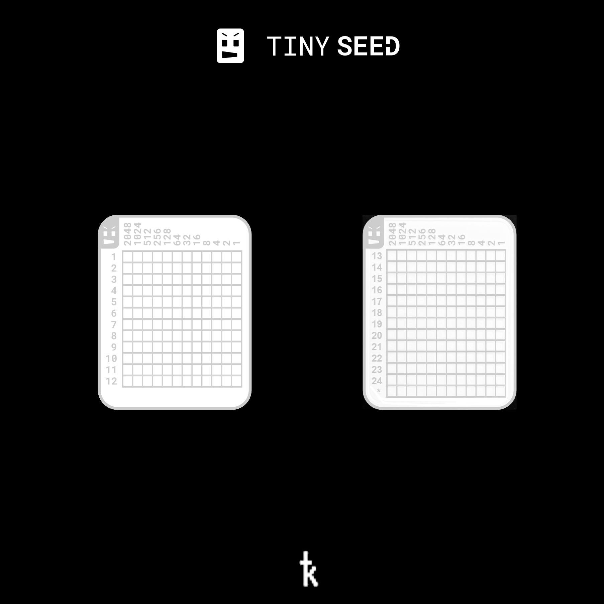

## Templates
Here we offer a few templates to transcribe QR codes, TinySeed or Binary Grid backups.

### QR Code Templates
Print the templates in standard, wax or slide paper, make sure the scale is set to 1:1 in printer setup.
You can manually copy compact SeedQR codes or place a proper sized template over the device screen.
Protect the template backside with a transparent tape so you won't bleed ink through the paper to your device's screen.
Then, using a marker, paint the QR code.

[Transcribe Templates - pdf](Krux_transcribe_templates.pdf)

[Transcribe Templates - svg](Krux_transcribe_templates.svg)

### TinySeed Templates

TinySeed background of blank templates to be manually filled.

### Binary Grid Templates

Binary Grid labeled and and "stealth" clean templates

[Binary Grid svg source](Krux_Binary_Grid_double_rev1.svg)

[Binary Grid Clean svg source](Krux_Binary_Grid_double_clean_rev1.svg)

### Edit Templates
To edit the source file (.svg) it is recommended to use Inkscape and set it to use mm unit. "Unscaled models" from QR code templates have the 21x21 or 25x25mm size for 12 or 24 respectively, this way making them easier to edit.