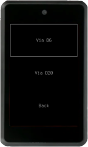
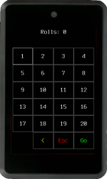
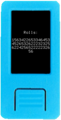
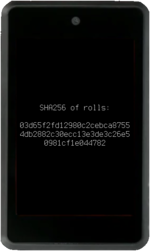

Krux has support for creating 12 and 24-word mnemonic seed phrases. Since true entropy is difficult to produce, especially with an embedded device, we recommend to outsource entropy generation using dice rolls, but it is also possible to use camera as a source of entropy to quickly create a mnemonic.
At the start screen, once you select `New Mnemonic`, you will be taken to a second menu where you can choose to create a mnemonic via camera, via rolls of a D6 (standard six-sided die) or D20 (20-sided die).

## Camera

 (Experimental!) Choose between 12 or 24 words, then take a random picture and Krux will generate a mnemonic from the hash of the image bytes.

## Dice Rolls
 
### Via D6

Choose between 12 or 24 words.

The entropy in a single roll of a D6 is 2.585 bits ( log2(6) ); therefore a minimum of a 50 rolls will be required for 128 bits of entropy, enough to generate a 12-word mnemonic. For 24 words, or an entropy of 256 bits, a minimum of 99 rolls will be required.

### Via D20

Since a D20 has more possible outcomes, the entropy is increased per roll to 4.322 bits ( log2(20) ). This means that only 30 rolls are necessary to create a 12-word mnemonic and 60 rolls for a 24-word mnemonic.

### How it works

For dice rolls, Krux keeps track of every roll you enter and displays the cumulative string of outcomes after each roll. 

When you have entered your final roll, Krux will hash this string using SHA256 and output the resulting hash to the screen so that you can verify it for yourself.

In the case a camera snapshot is used as source, image bytes, which contain pixels data in RGB565 format, will be hashed just like it is done with the dice rolls string.

Krux then takes this hash, runs [`unhexlify`](https://docs.python.org/3/library/binascii.html#binascii.unhexlify) on it to encode it as bytes, and deterministically converts it into a mnemonic according to the [BIP-39 Reference Implementation](https://github.com/trezor/python-mnemonic/blob/6b7ebdb3624bbcae1a7b3c5485427a5587795120/src/mnemonic/mnemonic.py#L189-L207).

Note: For 12-word mnemonics, only the first half of the SHA256 hash is used (128 bits), while 24-word mnemonics use the full hash (256 bits).

### How to verify

Don't trust, verify.  We encourage you not to trust any claim you cannot verify yourself. Therefore, there are wallets that use compatible algorithms to calculate the entropy derived from dice rolls. You can use the [SeedSigner](https://seedsigner.com/) or Coldcard hardware wallets, or even the [Bitcoiner Guide website](https://bitcoiner.guide/seed/), they share the same logic that Krux uses and will give the same mnemonic.

## Alternatives

You can use any other offline airgapped devices to generate your mnemonic. If you want to use a regular PC, a common strategy is to boot the PC using [Tails](https://tails.boum.org/) from a USB stick, without connecting the device to the internet, and then use a copy of the the [Bitcoiner Guide website](https://bitcoiner.guide/seed/) or even [Ian Coleman's BIP-39 Tool](https://iancoleman.io/bip39/). It's worth noting that both generate a QR code that Krux can read via the QR input method mentioned on the next page (Loading a Mnemonic).

See [here](https://vault12.com/securemycrypto/cryptocurrency-security-how-to/seed-phrase-creation/) for other good methods to generate a mnemonic manually.

