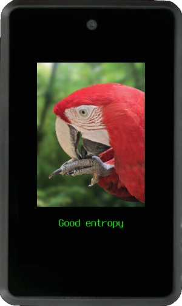
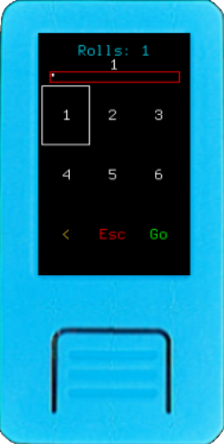
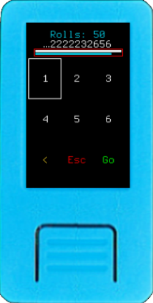
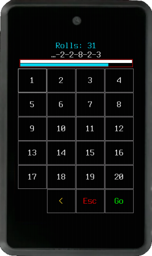
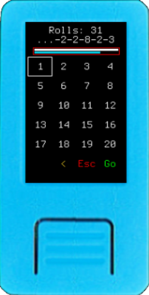
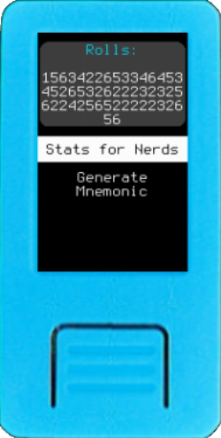
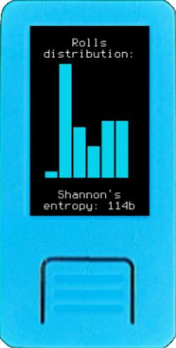
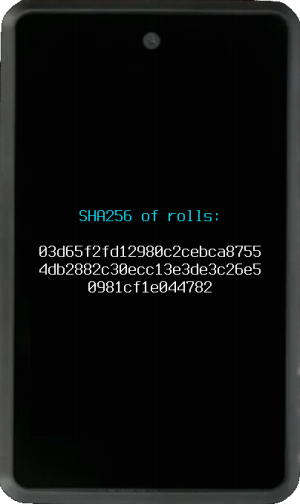

Krux supports creating 12 and 24-word [BIP39 mnemonic](https://github.com/bitcoin/bips/blob/master/bip-0039.mediawiki) seed phrases using random bits, also known as [entropy](https://en.wikipedia.org/wiki/Entropy_(computing)). Generating true entropy is challenging, especially for an embedded device, so we recommend outsourcing entropy generation using dice rolls. However, it is also possible to randomly pick words (e.g., SeedPicker) or use the camera as a source of entropy to quickly create a mnemonic.

At the start screen, select **New Mnemonic**, and choose between camera, words, rolls of a D6 (standard six-sided die), or a D20 (20-sided die).

## Camera
(Experimental!) Choose between 12, 24 words or double mnemonic, then take a random picture and Krux will generate a mnemonic from the hash of the image's raw bytes.<i style="font-size: 85%">[:material-numeric-1-circle:{ title="Conceptually similar to Lavarand" }](#lavarand)</i>

#### Image Entropy Quality Estimation

During image capture, a real-time entropy quality indicator is displayed to help you select a suitable image. After the photo is taken, [Shannon's entropy](https://en.wikipedia.org/wiki/Entropy_(information_theory)) and pixel deviation metrics are shown. Minimum thresholds are enforced to prevent using images with insufficient entropy quality.

**Note**: These metrics are *approximations* intended to guide image selection. They do **not** represent absolute cryptographic entropy values.

<i style="font-size: 85%">:material-numeric-1-circle:{id="lavarand"}:
This approach is conceptually similar to [Lavarand](https://en.wikipedia.org/wiki/Lavarand), which used chaotic visual phenomena as source of entropy for cryptographic random number generators. Likewise, Krux leverages the unpredictable structure of captured images as entropy.
</i>

#### Double mnemonic
It is the combination of two 12-word mnemonics that also forms a valid 24-word BIP39 mnemonic. This is achieved by using the first 16 bytes (128 bits) of the image's entropy to generate the first 12-word, then using the next 16 bytes to generate the second 12-word and checking if these two 12-word together forms a valid 24-word, if not, we iterate over the second 12-word incrementing its entropy bytes until the two 12-word forms a valid 24-word.

Double Mnemonic was first defined by Stepan Snigirev in his [Double Mnemonic Generator](https://stepansnigirev.github.io/seed-tools/double_mnemonic.html). It can be used for plausible deniability, or, as Stepan stated, to have fun and confuse everyone.

## Words
Print the [BIP39 word list](https://github.com/bitcoin/bips/blob/master/bip-0039/english.txt) in 3D or on paper, then cut out the words and place them in a bucket. Manually draw 11 or 23 words from the bucket.
For the final word, Krux will assist you in picking a valid 12th or 24th word by adjusting its smart keypad to only allow typing words with a valid checksum. Alternatively, you can leave it empty, and Krux will select a final, valid checksum word for you.

## Dice Rolls
### Via D6
Choose between 12 or 24 words. The entropy in a single roll of a D6 is 2.585 bits ( log2(6) ); therefore a minimum of 50 rolls is required for 128 bits of entropy, enough to generate a 12-word mnemonic. For 24 words, a minimum of 99 rolls is required for 256 bits of entropy.

### Via D20
The entropy in a single roll of a D20 is 4.322 bits ( log2(20) ); therefore a minimum of 30 rolls is required to generate a 12-word mnemonic and 60 rolls to generate a 24-word mnemonic.

### Dice Rolls Entropy Quality Estimation

As you enter your dice rolls, you'll see two progress bars fill up. The top progress bar shows how many rolls you've entered compared to the minimum required. The bottom progress bar shows the real-time calculated [Shannon's entropy](https://en.wikipedia.org/wiki/Entropy_(information_theory)) compared to the minimum required (128 bits for 12 words and 256 bits for 24 words). When the Shannon's entropy estimation reaches the recommended level, the progress bar will be full, and its frame will change color. If you've reached the minimum number of rolls but the entropy estimation is still below the recommended level, a warning will appear suggesting that you add more rolls to increase the entropy.

**Note**: Similar to image entropy quality estimation, dice rolls Shannon's entropy serves as an indicator and should not be considered an absolute measure of cryptographic entropy.

Learn more about [Krux Entropy Quality Estimation](../features/entropy.md).

### Stats for Nerds
A low Shannon's entropy value could suggest that your dice are biased or that there's a problem with how you're gathering entropy. To investigate further, examine the "Stats for Nerds" section to check the distribution of your rolls and look for any abnormalities.

## (Optional) Edit Mnemonic

After sufficient entropy is given, you can manually add custom entropy by editing some of the words. Simply touch or navigate to the word you want to change and replace it. Edited words will be highlighted, and the final word will automatically update to ensure a valid checksum. However, proceed with caution, modifying words can negatively impact the natural entropy previously captured.

On the next screen, you will be loading a wallet. You can read more about this in [Loading a Mnemonic -> Confirm Wallet Attributes](./loading-a-mnemonic.md/#confirm-wallet-attributes).

## How Entropy Works in Krux
For dice rolls, Krux keeps track of every roll you enter and displays the cumulative string of outcomes after each roll. 

When you have entered your final roll, Krux will hash this string using [SHA256](https://en.bitcoin.it/wiki/SHA-256) and output the resulting hash to the screen so that you can verify it for yourself.

In case a camera snapshot is used as a source, the image bytes, which contain pixels data in RGB565 format, will be hashed in the same way as the dice rolls.

Krux then takes this hash, runs [`unhexlify`](https://docs.python.org/3/library/binascii.html#binascii.unhexlify) on it to encode it as bytes, and deterministically converts it into a mnemonic according to the [BIP39 Reference Implementation](https://github.com/trezor/python-mnemonic/blob/6b7ebdb3624bbcae1a7b3c5485427a5587795120/src/mnemonic/mnemonic.py#L189-L207).

**Note**: For 12-word mnemonics, only the first half of the SHA256 hash is used (128 bits), while 24-word mnemonics use the full hash (256 bits).

### How to Verify
Don't trust, verify. We encourage you not to trust any claim you cannot verify yourself. Therefore, there are wallets that use compatible algorithms to calculate the entropy derived from dice rolls. You can use the [SeedSigner](https://seedsigner.com/) or [Coldcard](https://coldcard.com/) hardware wallets, or even the [Bitcoiner Guide website](https://bitcoiner.guide/seed/), they share the same logic that Krux uses and will give the same mnemonic for the dice roll method.
