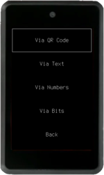
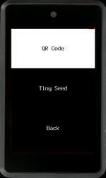
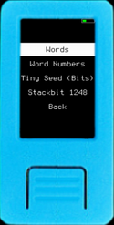
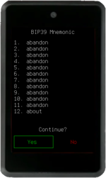
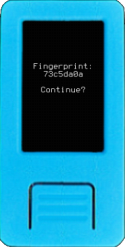

Once you have either a 12- or 24-word mnemonic, choose `Load Mnemonic` on Krux's start menu, and you will be presented with several input methods:

## Input Methods

### Via Camera

You can choose to use the camera to scan a `QR code` or `Tiny Seed` metal plate backup.

#### QR Code

It's unpleasant having to manually enter 12 or 24 words every time you want to use Krux. To remedy this you can instead use the device's camera to read a QR code containing the words. Krux will decode QR codes of four types:

1. **Plain text QR**: The mnemonic words encoded as text, with words separated by spaces.
2. [SeedQR](https://github.com/SeedSigner/seedsigner/blob/dev/docs/seed_qr/README.md): Basically, it is the mnemonic words of the respective BIP-39 numbers concatenated, encoded as text.
3. [Compact SeedQR](https://github.com/SeedSigner/seedsigner/blob/dev/docs/seed_qr/README.md#compactseedqr-specification): Basically, it is the mnemonic words bits concatenated as bytes.
4. [Encrypted Mnemonic](../features/encrypted-mnemonics.md): A specification created by Krux that encrypts the mnemonic words bits and adds some information about the encryption used.

After opening your wallet via one of the manual methods you can use Krux to create QR codes of all types above, transcript them to paper or metal using the transcription helpers or attach a thermal printer to your Krux and print out the mnemonic. Check out the [Printing section](../features/printing.md) for more information.
You can also use [an offline QR code generator for this](https://iancoleman.io/bip39/) (ideally on an airgapped device).

#### Tiny Seed

[Tiny Seed](https://tinyseed.io/) is a compact metal plate mnemonic backup method.
Krux devices have machine vision capabilities that allow users to scan these metal plates and instantly load mnemonics engraved on them. To properly scan them place the Tiny Seed over a black background and paint the punched bits black to increase contrast.

### Via Manual Input

Manually type `Words`, `Word Numbers`, `Tiny Seed` (toggle the bits or punches) or [`Stackbit`](https://stackbit.me) (model 1248 metal plate backup).

#### Words

Enter each word of your BIP-39 mnemonic one at a time. Krux will disable impossible-to-reach letters as you type and will attempt to autocomplete your words to speed up the process.

On your 12th or 24th word, you can leave the word blank to have Krux generate the final word of your mnemonic for you. This is handy if you chose a manual method to generate your mnemonic and want the final word to be a valid checksum.

#### Word Numbers

##### Decimal

Enter each word of your BIP-39 mnemonic as a number from 1 to 2048 one at a time. You can use [this list](https://github.com/bitcoin/bips/blob/master/bip-0039/english.txt) for reference.
##### Hexadecimal and Octal

You can also enter your mnemonic as hexadecimal numbers, with values ranging from 0x1 to 0x800 or octal numbers, with values ranging from 01 to 04000. This is useful with some metal plate backups that store mnemonic word numbers using these formats.

On your 12th or 24th word, you can leave the word blank to have Krux generate the final word of your mnemonic for you. This is handy if you chose a manual method to generate your mnemonic and want the final word to be a valid checksum.

#### Tiny Seed (Bits)

Enter each word of your BIP-39 mnemonic words in their binary form, toggling necessary bits to recreate each of the word's respective number. Last word will have checksum bits dynamically toggled while you fill previous bits.

#### Stackbit 1248

Enter mnemonic BIP-39 word's numbers using Stackbit 1248 metal plate backup method, where each of the four digits of the word's number is a sum of marked (punched) numbers 1,2,4 and 8. For example, to enter the word "pear", number 1297, you have to punch (1)(2)(1+8=9)(1+2+4=7)

### From Storage

You can retrieve mnemonics previously stored on device's internal flash or external (SD card). All stored mnemonics are encrypted, to load them you'll have to enter the same key you used to encrypt them.

## Wallet loading sequence

### Confirm Mnemonic Words

Once you have entered your mnemonic, you will be presented with the full list of words to confirm.

### Passphrase

After confirming the mnemonic words, you can optionally choose to type or scan a BIP-39 passphrase. You can create a QR code from your passphrase offline in [Tools](../features/tools.md#create-qr-code) section.

### Fingerprint

The wallet's fingerprint, if you have it noted down, will help you make sure you entered the correct mnemonic and passphrase(optional) and will load the expected wallet.

### Single-sig or Multisig

After loading your mnemonic and passphrase(optional), you will be asked if you want to use it as part of a `Single-sig` or `Multisig` wallet.

Your choice here will subtly change the generated xpub that is used to set up your device in your wallet coordinator software. You can learn more about the difference in the following guides for using [single-sig](using-a-single-sig-wallet.md) and [multisig](using-a-multisig-wallet.md) wallets.

Now, onto the main menu...

