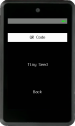
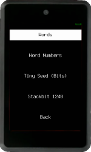
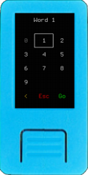
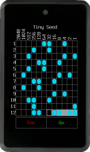
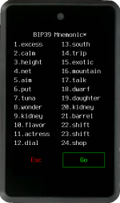

Once you have either a 12 or 24-word BIP-39 mnemonic, choose `Load Mnemonic` on Krux's start menu (aka login menu), and you will be presented with several input methods:

## Input Methods

### Via Camera
You can choose to use the camera to scan a `QR code`, `Tiny Seed`, `OneKey KeyTag` or a `Binary Grid`.

----8<----
camera-scan-tips.en.txt
----8<----

#### QR Code

It's unpleasant having to manually enter 12 or 24 words every time you want to use Krux. To remedy this you can instead use the device's camera to read a QR code containing the words. Krux will decode QR codes of four types:

- **Plain text QR**: The mnemonic words encoded as text, with words separated by spaces.
- [SeedQR](https://github.com/SeedSigner/seedsigner/blob/dev/docs/seed_qr/README.md): Basically, it is the mnemonic words of the respective BIP-39 numbers concatenated, encoded as text.
- [Compact SeedQR](https://github.com/SeedSigner/seedsigner/blob/dev/docs/seed_qr/README.md/#compactseedqr-specification): Basically, it is the mnemonic words bits concatenated as bytes.
- [Encrypted Mnemonic](../features/encrypted-mnemonics.md): A specification created by Krux that encrypts the mnemonic words bits and adds some information about the encryption used.

After opening a wallet via one of the methods available you can use Krux to [backup the mnemonic](navigating-the-main-menu.md#backup-mnemonic) as QR code, transcribe them to paper or metal using the transcription helpers or attach a thermal printer to your Krux and print out the mnemonic as QR. Check out the [printing section](../features/printing.md) for more information.
You can also use [an offline QR code generator for this](https://iancoleman.io/bip39/) (ideally on an airgapped device).

#### Tiny Seed, OneKey KeyTag or Binary Grid
[Tiny Seed](https://tinyseed.io/), [Onekey KeyTag](https://onekey.so/products/onekey-keytag/) and others directly encode a seed as binary, allowing for a very compact mnemonic storage. Krux devices have machine vision capabilities that allow users to scan these metal plates and instantly load mnemonics engraved on them (this feature is not available in Krux Android app).

To properly scan, place the backup plate over a black background and paint the punched bits black to increase contrast. You can also scan the thermally printed version, or a filled template. You can find some [examples of mnemonics encoded here](../features/tinyseed.md). Alternatively, you can find [templates to scan or print here](https://github.com/odudex/krux_binaries/tree/main/templates).

### Via Manual Input

Manually type `Words`, `Word Numbers`, `Tiny Seed` (toggle the bits or punches) or [`Stackbit 1248`](https://stackbit.me/produto/stackbit-1248/).

#### Words

Enter each word of your BIP-39 mnemonic one at a time. Krux will disable impossible-to-reach letters as you type and will attempt to autocomplete your words to speed up the process.

#### Word Numbers

##### Decimal
Enter each word of your BIP-39 mnemonic as a number (1-2048) one at a time. You can use [this list](https://github.com/bitcoin/bips/blob/master/bip-0039/english.txt) for reference.

##### Hexadecimal and Octal
You can also enter your BIP-39 mnemonic word's numbers (1-2048) in hexadecimal format, with values ranging from 0x1 to 0x800, or in octal format, with values ranging from 01 to 04000. This is useful with some metal plate backups that uses those formats.

#### Tiny Seed (Bits)

Enter the BIP-39 mnemonic word's numbers (1-2048) in binary format, toggling necessary bits to recreate each of the word's respective number. The last word will have checksum bits dynamically toggled while you fill the bits.

#### Stackbit 1248

Enter the BIP-39 mnemonic word's numbers (1-2048) using the Stackbit 1248 metal plate backup method, where each of the four digits of the word's number is a sum of the numbers marked (punched) 1, 2, 4, or 8. For example, to enter the word "oyster", number 1268, you must punch (1)(2)(2,4)(8).

### From Storage

You can retrieve mnemonics previously stored on device's internal flash or external (SD card). All stored mnemonics are encrypted, to load them you'll have to enter the same key you used to encrypt them.

## Wallet Loading
### Confirm Mnemonic Words

Once you have entered your mnemonic, you will be presented with the full list of words to confirm. 

If you see an asterisk (`*`) in the header, it means this is a [double mnemonic](generating-a-mnemonic.md/#double-mnemonic).

### Edit Mnemonic - Optional

If you make a mistake while loading a mnemonic, you can easily edit it. Simply touch or navigate to the word you want to change and replace it. Edited words will be highlighted in a different color. If the final word contains an invalid checksum, it will appear in red. If your checksum word is red, please review your mnemonic carefully, as there may be an error.

### Confirm Wallet Attributes

You will be presented with a screen containing wallet attributes, if they are as expected just press `Load Wallet` and you'll be ready to use your loaded key.

#### Fingerprint 
* :material-fingerprint: ` 73c5da0a `:
The BIP-32 master wallet's fingerprint, if you have it noted down, will help you make sure you entered the correct mnemonic and passphrase (optional) and will load the expected wallet.

#### Network 
* ` Mainnet `:
Check if you are loading a `Testnet` or `Mainnet` wallet.

#### Single / Multisig
* ` Single-sig `:
Check if you are loading a `Single-sig` or `Multisig` wallet.

#### Derivation Path
* ` m/84'/0'/0' `:
The derivation path is a sequence of numbers, or "nodes", that define the script type, network, and account index of your wallet.
    * **Script Type** `84'`: The first number defines the script type. The default is `84'`, corresponding to a Native Segwit wallet. Other values include:
        * `44'` for Legacy
        * `49'` for Nested Segwit
        * `86'` for Taproot
        * `48'` for Multisig
    * **Network** `0'`: The second number defines the network:
        * `0'` for Mainnet
        * `1'` for Testnet
    * **Account Index** `0'`: The third number is the account index, with `0'` being the default.
    * **Additional**: For multisig wallets, a fourth node with the value `2'` is added to the derivation path.

#### Passphrase
* ` No Passphrase `:
Informs if the wallet has a loaded passphrase.

### Customize
You can change any of the attributes before and after loading a wallet.
It is also possible to change default settings for `Network` and `Single/Multisig` on [settings](../settings.md).

#### Passphrase

You can type or scan a BIP-39 passphrase. When typing, swipe left :material-gesture-swipe-left: or right :material-gesture-swipe-right: to change keypads if your device has a touchscreen. You can also hold the button `PAGE` or `PAGE_PREV` when navigating among letters while typing text to fast forward or backward. For scanning, you can also create a QR code from your offline passphrase using the [create QR code tool](../features/tools.md/#create-qr-code).

#### Customize

Press `Customize` to open a menu where you can change the `Network`, `Single/Multisig`, `Script Type` and `Account`.

Now, onto the main menu...
