Once you have either a 12 or 24-word [BIP39 mnemonic](https://github.com/bitcoin/bips/blob/master/bip-0039.mediawiki), choose `Load Mnemonic` on Krux's start menu, then choose the backup format you recognise:

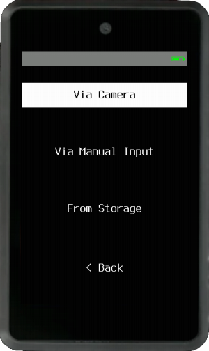
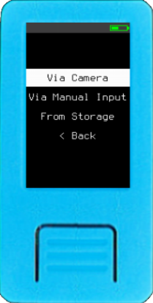

## Backup Formats

### QR Code

Use the camera to read a QR code containing the mnemonic. Krux can decode four types:

- **Plain text QR**: mnemonic words separated by spaces
- [SeedQR](https://github.com/SeedSigner/seedsigner/blob/dev/docs/seed_qr/README.md): the BIP39 word numbers concatenated as text
- [Compact SeedQR](https://github.com/SeedSigner/seedsigner/blob/dev/docs/seed_qr/README.md/#compactseedqr-specification): the mnemonic bits concatenated as bytes
- [Encrypted Mnemonic](../features/encryption/encryption.md/#regarding-bip39-mnemonics): a Krux format that encrypts the mnemonic bits and records the encryption method.

----8<----
camera-scan-tips.en.txt
----8<----

After opening a wallet, you can use Krux to [back up the mnemonic](navigating-the-main-menu.md#backup-mnemonic) as a QR code, [transcribe](../features/QR-transcript-tools.md) it to paper or metal, or print it with a thermal printer. See the [printing section](../features/printing/printing.md) for more information. You can also use an [offline QR code generator](https://iancoleman.io/bip39/), ideally on an air-gapped device.

### Words

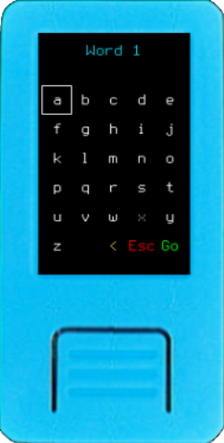
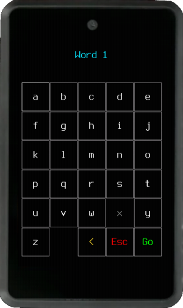

Enter each BIP39 word one at a time. Krux disables impossible letters as you type and attempts to autocomplete each word.

### From Storage

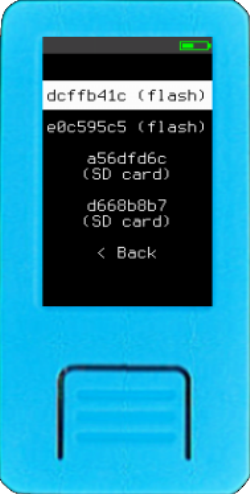
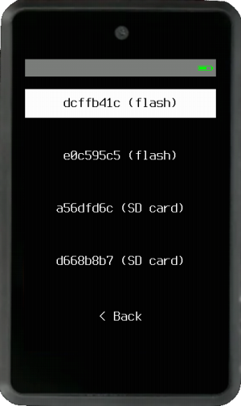

Retrieve an [encrypted mnemonic previously stored](./navigating-the-main-menu.md/#encrypted) in internal memory or on an SD card. Enter the same key that was used to encrypt it.

### Other Formats

Specialist backup formats are grouped in one menu: `Tinyseed (scan)`, `Binary Grid (manual)`, `OneKey KeyTag (scan)`, `Binary Grid (scan)`, `Word Numbers`, and `Stackbit 1248`.

#### Tinyseed (scan)

[Tinyseed](https://tinyseed.io/) directly encodes a seed as binary on a compact backup plate. Krux can scan a completed Tinyseed with its camera. This feature is not available in the [Krux Mobile Android app](../../faq.md#what-is-krux-mobile-android-app).

Place the backup over a black background and fill punched areas with black to improve contrast. You can also scan a [thermally printed version](../features/printing/printing.md) or a completed template. See the [encoded examples](../features/tinyseed.md) and [transcription templates](../templates/index.md).

#### Binary Grid (manual)

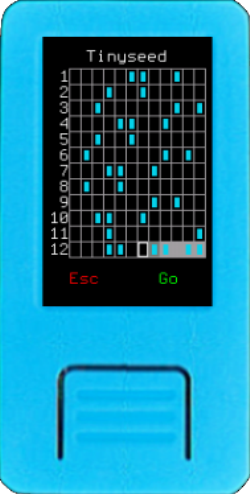
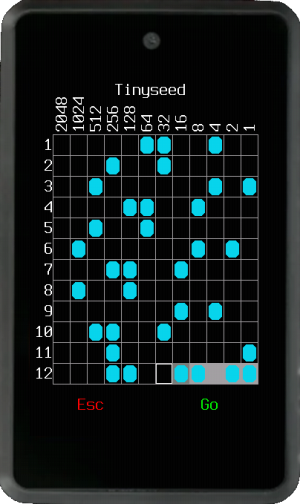

Enter each BIP39 word number (1-2048) in binary by toggling its bits. Krux calculates the checksum bits for the final word while you enter it.

**Tip**: You can use this screen to generate a mnemonic with coin flips:

- For each bit through 1024, mark it for heads and leave it unmarked for tails
- For the last word, Krux calculates the checksum positions. Flip seven times for a 12-word mnemonic or three times for a 24-word mnemonic.

#### OneKey KeyTag (scan)

[OneKey KeyTag](https://onekey.so/products/onekey-keytag/) also stores a seed as a compact binary pattern. Use the camera to scan the completed plate.

#### Binary Grid (scan)

Use the camera to scan another supported binary-grid backup or a completed
transcription template.

#### Word Numbers

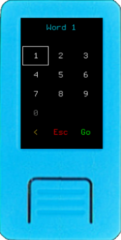
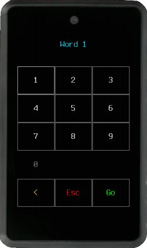

##### Decimal

Enter each BIP39 word as its number from 1 to 2048. Use the [BIP39 English word list](https://github.com/bitcoin/bips/blob/master/bip-0039/english.txt) for reference.

##### Hexadecimal and Octal

Word numbers can also be entered in hexadecimal from `0x1` to `0x800`, or in octal from `01` to `04000`. These forms are useful with metal backups that use those number systems.

#### Stackbit 1248

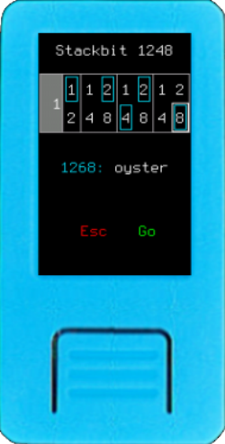
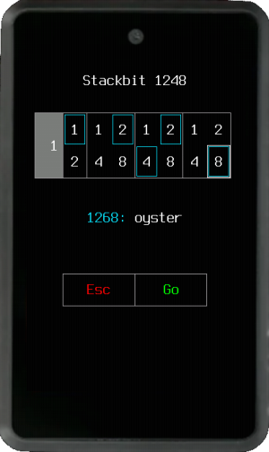

Enter each BIP39 word number with the [Stackbit 1248](https://stackbit.me/produto/stackbit-1248/) backup method. Each digit is the sum of marked values 1, 2, 4, or 8. For example, word number 1268 uses `(1)(2)(2,4)(8)`.

## Confirm Wallet Setup
### Confirm Mnemonic Words
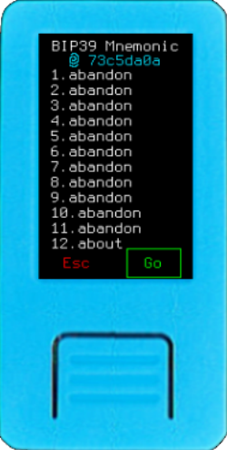
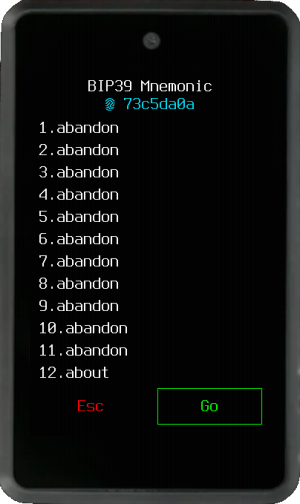

Once you have entered your mnemonic, you will be presented with the full list of words to confirm. A 12 word has only 4 checksum bits, so it has a 1 in 16 chance (6,25%) of still being valid even if you mistype a word. A 24 word phrase has 8 checksum bits, so it only has 1 in 256 chance (~0,4%) of still being valid if you mistype a word.

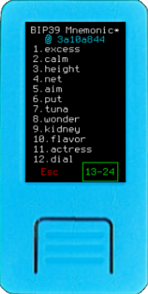
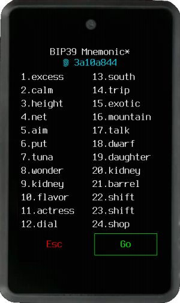
If you see an asterisk (`*`) in the header, it means this is a [double mnemonic](generating-a-mnemonic.md/#double-mnemonic).

### (Optional) Edit Mnemonic
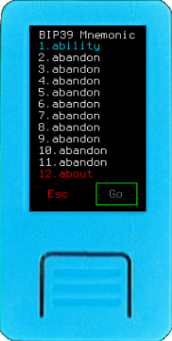
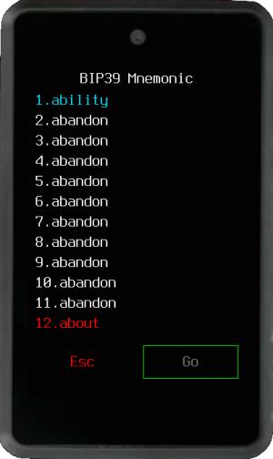

If you make a mistake while loading a mnemonic, you can easily edit it. Simply touch or navigate to the word you want to change and replace it. Edited words will be highlighted. If the final word contains an invalid checksum, it will appear in red. If your checksum word is red, please review your mnemonic carefully, as there may be an error.

### Confirm Wallet Attributes
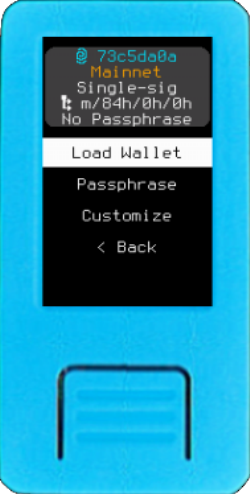
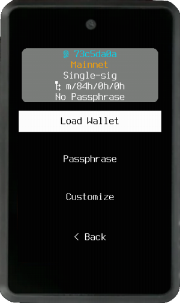

After confirming an existing mnemonic, a screen with an **information box at the
top** shows the wallet's attributes. If they are as expected, just press
`Load Wallet`. If you need to change something, you may customize the wallet by
setting a `Passphrase` or using the `Customize` button.

#### The Attributes:

##### Fingerprint 
* :material-fingerprint: ` 73c5da0a `:
The [BIP32](https://github.com/bitcoin/bips/blob/master/bip-0032.mediawiki) master wallet's fingerprint helps you make sure you entered the correct mnemonic and passphrase (optional) and will load the expected wallet. The fingerprint is the best checksum you can have, it's good to note it down.

##### Network 
* ` Mainnet `:
Check if you are loading a `Testnet` or `Mainnet` wallet.

##### Policy Type
* Check the wallet's policy type: `Single-sig`, `Multisig`, `Miniscript`, or `TR Miniscript` (Taproot).

##### Derivation Path
* :material-arrow-right-bottom: ` m/84h/0h/0h `:
The derivation path is a sequence of numbers, or "nodes", that define the script type, network, and account index of your wallet.
    * **Script Type** `84h`: The first number defines the script type. The default is `84h`, corresponding to a Native Segwit wallet. Other values include:
        * `44h` for Legacy
        * `49h` for Nested Segwit
        * `86h` for Taproot
        * `48h` for Multisig
    * **Network** `0h`: The second number defines the network:
        * `0h` for Mainnet
        * `1h` for Testnet
    * **Account Index** `0h`: The third number is the account index, with `0h` being the default.
    * **Additional**: For multisig wallets, a fourth node with the value `2h` is added to the derivation path.

    Default Miniscript derivation path is the same as for multisig: ` m/48'/0h/0h/2h `, but they can be fully customized

##### Passphrase
* ` No Passphrase `:
Informs if the wallet has a passphrase. Adding or changing the passphrase results in a completely different wallet and fingerprint.

### Customize Wallet
It is possible to change any of the **wallet's attributes** (it will be possible to change them later too, after loading). To load it faster next time, some default wallet attributes can be set in [settings](../settings.md), they are: `Network`, `Policy Type` and `Script Type`.

#### Passphrase

You can type or scan a BIP39 passphrase from the same keypad. Swipe right
:material-gesture-swipe-right: to reach the last symbols keypad on touchscreen
devices, or use the keypad toggle on button devices, then select the QR glyph.
After a successful scan, the passphrase returns to the keypad so you can review
or edit it before pressing `Go`. If text is already present, Krux asks before
replacing it; cancelling or failing a scan preserves the existing text.

For scanning, you can generate an offline passphrase QR code using the [Datum tool](../features/tools.md/#datum-tool).

**Note**: [BIP39](https://github.com/bitcoin/bips/blob/master/bip-0039.mediawiki#from-mnemonic-to-seed) requires passphrases to be NFKD-normalized. Due to firmware size constraints, Krux cannot perform normalization internally. We therefore recommend using only ASCII QR codes or ensuring any non-ASCII are already normalized to NFKD.

#### Customize
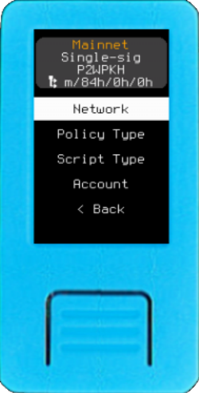
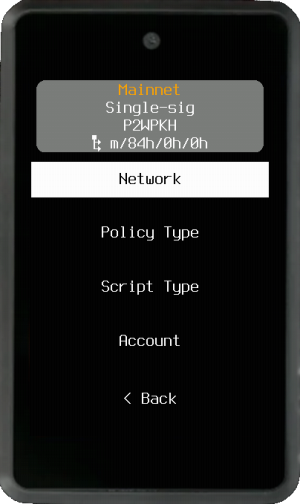

This button opens a screen to change the `Network`, `Policy Type`, `Script Type`, and `Account` of the wallet. If `Policy Type` is Miniscript, you will be able to enter a custom derivation path.

When everything looks good, press `Load Wallet`and you will go to the main menu...
