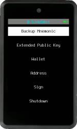
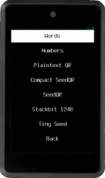
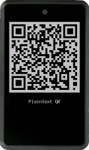
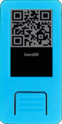
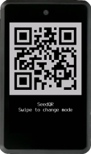
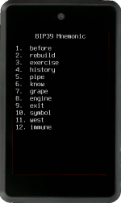
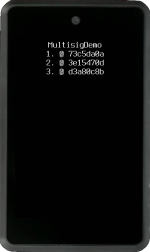
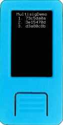
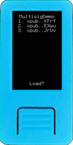
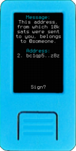

After entering your mnemonic, and loading a wallet, you will find yourself on Krux's main menu. Below is a breakdown of the entries available:

### Backup Mnemonic

This will open a new submenu with different types of backups. `QR Code` based, `Encrypted`  and `Other Formats`

If you set a [printer](../settings.md/#printer), it will also give the option to print them!

#### QR Code
- **Plaintext QR**

Generate a QR containing the mnemonic words as regular text, where words are separated by spaces. Any QR code can be printed if a thermal printer driver is set.

- **Compact SeedQR**

A QR code is created from a binary representation of mnemonic words. Format created by SeedSigner, more info [here](https://github.com/SeedSigner/seedsigner/blob/dev/docs/seed_qr/README.md#compactseedqr-specification).

- **SeedQR**

Words are converted to their BIP-39 numeric indexes, those numbers are then concatenated as a string and finally converted to a QR code. Format created by SeedSigner, more info [here](https://github.com/SeedSigner/seedsigner/blob/dev/docs/seed_qr/README.md).

- **Encrypted QR Code**

This option converts the encrypted mnemonic into a QR code. Enter an encryption key and, optionally, a custom ID. When you scan this QR code through "Load Mnemonic" -> "Via Camera" -> "QR Code," you will be prompted to enter the decryption key to load the mnemonic stored in it. Like any QR code, it can be printed if a thermal printer driver is set up.

#### Encrypted

This feature allows you to back up your mnemonic by encrypting it and storing it on the device's flash memory, an SD card, or in QR code format. You can customize the encryption method and parameters in the settings.

For convenience, you may choose to store the encrypted mnemonic on flash memory or an SD card, but it is advisable not to rely solely on these methods for backup. Flash storage can degrade over time and may be subject to permanent damage, resulting in the loss of stored information.

When using any of the encryption methods, you will be prompted to enter an encryption key. This key can be provided in text or QR code format. Additionally, you have the option to set a custom ID for easier management of your mnemonics. If a custom key is not specified, the device's current loaded wallet fingerprint will be used as the ID.

See this page to find out more about: [Krux Mnemonics Encryption](../../getting-started/features/encrypted-mnemonics.md).

- **Store on Flash**

This option stores the encrypted mnemonic in the device's flash memory. You can decrypt and load it later through the "Load Mnemonic" -> "From Storage" option.

- **Store on SD Card**

If an SD card is available, this option stores the encrypted mnemonic on it. You can decrypt and load it later through the "Load Mnemonic" -> "From Storage" option.

- **Encrypted QR Code**
It's another path for the same functionality present on QR Code backups, described above.

#### Other Formats

- **Words**

Display the BIP-39 mnemonic words as text so you can write them down.

- **Numbers**

Display the BIP-39 mnemonic word numbers (1-2048) in decimal, hex, or octal format.

- **Stackbit 1248**

This metal backup format represents the BIP-39 mnemonic word's numbers (1-2048). Each of the four digits is converted to a sum of 1, 2, 4 or 8. This option does not print even if a printer driver is set.

- **Tiny Seed**

This metal backup format represents the BIP-39 mnemonic word's numbers (1-2048) in binary format on a metal plate, where the 1's are marked (punched) and the 0's are left intact. You can also print your mnemonic in this format if a thermal printer driver is set.

### Extended Public Key

A menu will be presented with options to display your master extended public key (xpub) as text and as a QR code. Depending on the script type or whether a single-sig or multisig wallet was loaded, the options shown will be xpub, ypub, zpub, or Zpub. When displayed as text, the extended public key can be stored on an SD card if available. If you choose to export a QR code, you can not only scan it but also save it as an image on an SD card or print it if a thermal printer is attached.

All QR codes will contain [key origin information in key expressions](https://github.com/bitcoin/bips/blob/master/bip-0380.mediawiki#Key_Expressions). If your coordinator cannot parse this information, it will not be capable of importing the wallet's fingerprint. As a result, Krux will not perform important verifications when signing transactions created by it unless you manually add the fingerprint so that it can be used to create Krux-compatible PSBTs.

Always prefer to import extended public keys directly from Krux when setting up a coordinator instead of copying it (or parts of it) from other sources.

### Wallet
Here you can load view and save wallet descriptors, add or change passphrases, customize wallet's attributes, derive BIP85 mnemonics and passwords.

#### Wallet Descriptor
A Bitcoin Wallet Output Script Descriptor defines a set of addresses in a wallet. It includes the following information:
- Script Type: Specifies the type of script (e.g., P2PKH, P2SH, P2WPKH).
- Origin Info: Defines the master fingerprint and derivation path used to derive keys.
- Extended Public Keys: usually represented as an xpub, but could be ypub, zpub, etc.

Output descriptors standardize how wallets generate addresses, ensuring compatibility and security. They help wallets and other software understand how to derive and verify the addresses used in transactions.

For multisig wallets, it is essential to load a descriptor to check addresses and perform full PSBT verification. For single-sig wallets, loading a descriptor is optional and serves as a redundancy check of the coordinator's wallet attributes.

When you select the "Wallet Descriptor" option for the first time, you will be prompted to load a wallet descriptor via QR code or SD card. After loading, a preview of the wallet attributes will be displayed for confirmation.

If you access the "Wallet Descriptor" option again after loading your wallet, you will see the wallet's name, fingerprints, and the abbreviated XPUBs of all cosigners, along with a QR code containing the exact data that was initially loaded. If an SD card is inserted, you can save the descriptor to it for later use without the assistance of a coordinator. Additionally, if you have a thermal printer attached, you can print this QR code.

Krux also allows you to verify a descriptor's receive and change addresses without the need to load private keys. Simply turn on your Krux, access "Tools" -> "Descriptor Addresses," and load a trusted descriptor from a QR code or SD card.

Please note that if you customize the wallet parameters or restart the device, the descriptor will be unloaded, and you may need to load it again to check addresses.

#### Passphrase

If you forgot to load a passphrase while loading your wallet, or if you use multiple passphrases with the same mnemonic, you can add, replace, or remove a passphrase here. Simply choose between typing or scanning it.

To remove a passphrase, select "Type BIP39 Passphrase," leave the field blank, and press "Go."

Don't forget to verify the resulting fingerprint in the status bar to ensure you've loaded the correct key.

#### Customize

Here you are presented to the exact same customization options you have while loading a key and wallet. You can change the Network, Single/Multisig, Script Type and Account. [More about wallet attributes](./loading-a-mnemonic.md/#confirm-wallet-attributes)

#### BIP85
Bitcoin BIP85, also known as Deterministic Entropy From BIP32 Keychains, allows for the generation of deterministic entropy using a BIP32 master key. This entropy can then be used to create various cryptographic keys and mnemonics (e.g., BIP39 seed phrases). BIP85 ensures that all derived keys and mnemonics are deterministic and reproducible, meaning they can be recreated from the same master key. This feature is useful for securely managing multiple child keys from a single master key without the need to store each one separately.

**BIP39 Mnemonic**

Choose between 12 or 24 words, then type the desired index to export a child mnemonic. After being presented with the new mnemonic, you can choose to load and use it right away.

Please note that any passphrase from the parent mnemonic will be removed when loading a BIP85 child mnemonic.

**Base64 Password**

To create a Base64 password, which can be used in a variety of logins, from email to social media accounts, choose an index and then a length of at least 20 characters.

The resulting password will be displayed on the screen and can also be exported to an SD Card or as a QR code.

### Address

Scan, verify, export or print your wallet addresses.

#### Scan Address

This option turns on the camera and allows you to scan in a QR code of a receive address. Upon scanning, it will render its own QR code of the address back to the display along with the (text) address below it. You could use this feature to scan the address of someone you want to send coins to and display the QR back to your wallet coordinator rather than copy-pasting an address. If you have a thermal printer attached, you can also print this QR code. 

After proceeding through this screen, you will be asked if you want to check that the address belongs to your wallet. If you confirm, it will exhaustively search through as many addresses derived from your wallet as you want in order to find a match.

This option exists as an extra security check to verify that the address your wallet coordinator has generated is authentic and belongs to your wallet.

#### Receive Addresses

List your wallet receiving addresses, you can browse to select an arbitrary address to show your QR code and print if you want.

#### Change Addresses

List your wallet change addresses, you can browse to select an arbitrary address to show your QR code and print if you want.

### Sign

Under *Sign*, you can choose to sign a PSBT or a message. You can load both PSBTs and messages scanning QR codes or loading from files on a SD card.

#### PSBT

To sign a Bitcoin PSBT, you have the following options:

- **Scan an Animated QR Code**: Turn on the camera and scan an animated QR code of a PSBT generated by your wallet coordinator software. If you have any issues, see [Troubleshooting](../../troubleshooting.md/#why-isnt-krux-scanning-the-qr-code).
- **Load from SD Card**: Load an unsigned PSBT file from your SD card.

Upon loading the PSBT, you will be presented with a preview showing the amount of BTC being sent, the recipient's address, and the transaction fee. Amounts are displayed according to your locale and the International Bureau of Weights and Measures, while still adhering to the concept of the [Satcomma standard format](https://medium.com/coinmonks/the-satcomma-standard-89f1e7c2aede).

If you choose to proceed and sign the transaction, the signed PSBT can be exported in two ways:

- *As an animated QR code*, which can be scanned back into your coordinator wallet.
- *As a signed PSBT file*, which can be saved to your SD card and then loaded back into your coordinator wallet for broadcasting.

If a thermal printer is attached to your device, you can also print the PSBT QR codes for record-keeping or further processing.

#### Message
Similar to PSBTs, Krux can load, sign, and export signatures for messages. This feature allows you to attest not only to the ownership of the messages themselves but also to the ownership of Bitcoin addresses and the authorship of documents and files.

##### Standard Messages and Files

You can scan or load a file from an SD card, the content can be plaintext or the SHA-256 hash of a message. Upon loading, you will be shown a preview of the message's SHA-256 hash for confirmation before signing.

If you confirm, a signature will be generated, and you will see a base64-encoded version of it. You can then choose to export it as a QR code or save it to an SD card. If a thermal printer is attached, you can also print the QR code.

Following this, you will see and be allowed to export your raw (master) public key in hexadecimal form, which can be used by others to verify your signature. If a thermal printer is attached, you can also print this QR code.

This feature is used to sign Krux releases, airgapped, using a Krux device.

##### Messages at Address

Coordinators like Sparrow and Specter offer the possibility to sign messages at a Bitcoin receive address, allowing you to attest ownership of that address. Krux will detect if the message is of this type and present a similar workflow for signing. The main difference is that the address will be displayed along with the raw message, and since the message is signed with a derived address instead of the master public key, Krux won't offer the option to export the raw public key after the signature.

