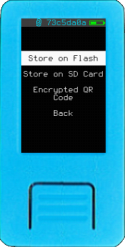
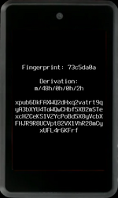
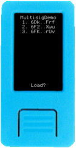
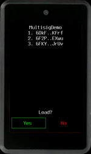
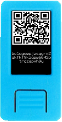
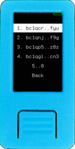

After entering your mnemonic, you will find yourself on Krux's main menu. Below is a breakdown of the entries available:

### Mnemonic
This will open a new submenu with several options to backup your mnemonic.

#### Words

Display the mnemonic words as text so you can write them down.

#### Plaintext QR

Generate a QR containing the mnemonic words as regular text, where words are separated by spaces.

#### Compact SeedQR

A QR code is created from a binary representation of mnemonic words. Format created by SeedSigner

#### SeedQR

Words are converted to their BIP39 numeric indexes, those numbers are then concatenated as a string and finally converted to a QR code. Format created by SeedSigner

#### Stackbit 1248

Words are converted to their BIP39 numeric indexes, then each of the four digits is converted to a sum of 1,2,4 or 8.

#### Tiny Seed

This metal backup format represent BIP39 mnemonic word numbers index on its binary form on a metal plate, where 1's are marked(punched) and 0's are left intact

### Encrypt Mnemonic

Here you can backup your mnemonic by storing them encrypted on a device's flash, on a SD card, or QR code format.
The encryption method and parameters can be modified in settings.
Use flash or SD card storage for convenience but never as your only backup method, there are many ways flash storage and the information it contains can degrade and be permanently damaged.

On all below methods you'll be prompted to enter a encryption key, which can be in text or QR code format. You can also define a custom ID to help you manage your mnemonics. In case a custom key is not set, the current fingerprint will be used as ID.

#### Store on Flash

The encrypted mnemonic will be stored on device's flash memory, and will be available to be decrypted and loaded via "Load Mnemonic"->"From Storage".

#### Store on SD Card

The encrypted mnemonic will be stored on a SD card, if available, and will be available to be decrypted and loaded via "Load Mnemonic"->"From Storage".

#### Encrypted QR Code

The encrypted mnemonic will be converted to a QR code. When you scan this QR code via "Load Mnemonic"->"Via Camera"->"QR Code", you'll be prompted to enter decryption key to load the mnemonic.

### Extended Public Key

This option displays your master extended public key (xpub) as text as well as a QR code. The extended public key (xpub) can also be stored on a SD card if available.

After the xpub, a zpub or Zpub is shown depending on if a single-sig or multisig wallet was chosen. This z/Zpub is usually not necessary unless you are using a wallet coordinator that either cannot parse or ignores [key origin information in key expressions](https://github.com/bitcoin/bips/blob/master/bip-0380.mediawiki#Key_Expressions).

If a thermal printer is attached, you can print both QR codes.

### Wallet Descriptor

When you first select this option, you will be prompted to load a wallet. At this point, the camera will turn on and you will need to scan a wallet backup QR code from your wallet coordinator software. If scanned successfully, you will see a preview of the wallet to confirm.

If you return to this option after having loaded your wallet, you will see the wallet's name and the (abbreviated) xpubs of all cosigners along with a QR code containing the same exact data that was loaded. If you have a thermal printer attached, you can print this QR code.  

Note that you currently can't change the wallet once one has been loaded. To do this, you will need to restart the device and re-enter your mnemonic.

### Address

#### Scan Address

This option turns on the camera and allows you to scan in a QR code of a receive address. Upon scanning, it will render its own QR code of the address back to the display along with the (text) address below it. You could use this feature to scan the address of someone you want to send coins to and display the QR back to your wallet coordinator rather than copy-pasting an address.

If you have a thermal printer attached, you can also print this QR code. 

After proceeding through this screen, you will be asked if you want to check that the address belongs to your wallet. If you confirm, it will exhaustively search through as many addresses derived from your wallet as you want in order to find a match.

This option exists as an extra security check to verify that the address your wallet coordinator has generated is authentic and belongs to your wallet.

#### Receive Addresses

List your wallet receiving addresses, you can browse to select an arbitrary address to show your QRCode and print if you want

#### Change Addresses

List your wallet change addresses, you can browse to select an arbitrary address to show your QRCode and print if you want

### Sign

Under *Sign*, you can choose to sign a PSBT or a message (sha256 hash).

#### PSBT

This option turns on the camera and allows you to scan an animated QR code of a PSBT generated by your wallet coordinator software. Upon scanning, you will be shown a preview of how much BTC is being sent, who is receiving it, and the fee that is being paid. Amounts are displayed according to the locale and the International Bureau of Weights and Measures, while still using the idea behind the [Satcomma standard format](https://medium.com/coinmonks/the-satcomma-standard-89f1e7c2aede).

If you confirm, a signed PSBT will be generated and an animated QR code will be displayed that you can use to import the signed PSBT back into your wallet coordinator software. If a thermal printer is attached, you can also print the QR codes.

#### Message

This option turns on the camera and allows you to scan a QR code of a message or the sha256 hash of one. Upon scanning, you will be shown a preview of the message's sha256 hash to confirm before signing.

If you confirm, a signature will be generated and you will see a base64-encoded version of it followed by a QR code of it. If a thermal printer is attached, you can also print the QR code.

Proceeding that, you will see your raw (master) public key in hexadecimal form, followed by a QR code of it, that can be used by others to verify your signature. If a thermal printer is attached, you can also print the QR code.

