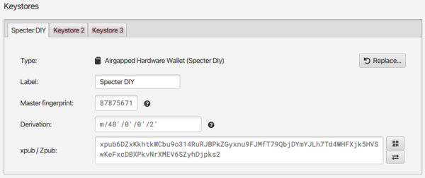
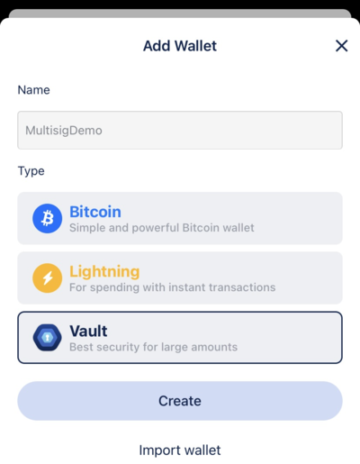
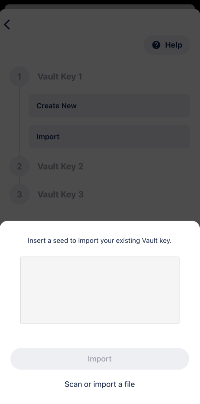

This guide assumes you have already created a mnemonic for each cosigner that will be in your multisig wallet. If that is not the case, head over to the [Generating a Mnemonic](generating-a-mnemonic.md) page and complete those steps first.

When entering your mnemonics into Krux, make sure to select `Multisig` for all keys in your multisignature scheme. The choice of `Single-sig` vs. `Multisig` at this point will change the derivation path used to generate your master extended public key (xpub) which will affect how wallet software handles it.

Selecting `Multisig` will derive an xpub using the derivation path `m/48'/0'/0'/2'` on mainnet and `m/48'/1'/0'/2'` on testnet, which indicates to wallet software that a [Multisig Wallet script type](https://github.com/bitcoin/bips/blob/master/bip-0048.mediawiki) should be used, specifically the Native Segwit script `P2WSH`, or just `wsh`.

**Note:** While not required, the load of the `Wallet Descriptor` is strongly recommended to load your multisig wallet into Krux before signing a PSBT as it will allow the device to verify that the transaction it is signing has the correct list of cosigners as defined in the wallet. It is also useful if you wish to [print a backup](../features/printing.md) of the wallet or visually inspect the list of cosigners being output by your wallet coordinator.

## Specter Desktop
### Create the wallet
In Specter Desktop, you will need to import your public key by adding a new device. Press the *Add new device* button on the left side of the app.

Krux is not listed as one of the available device types on the *Add Device* screen, so you will need to select the *Other* option.

You will be taken to the *Upload Keys* screen where you can choose to *Scan QR code*.

On your Krux, navigate to the *Extended Public Key* option under the main menu and show the **first** QR code to Specter Desktop.

It should import the xpub and display the *Purpose* as *#0 Multisig Sig (Segwit)*.

Give the device a name and press *Continue*. You should see the new device in the devices list on the left side of the app.

Repeat this process for every key that will be in your multisig wallet.

Once all key devices have been added, you can make a wallet using them. Press the *Add new wallet* button on the left side of the app.

Choose to create a *Multisignature wallet* when it asks which type of wallet you want on the following screen.

Select the devices you just added and press *Continue*.

Give your wallet a name, make sure to select *Segwit* for the wallet type, and decide how many of your keys are required to sign a transaction, then press *Create wallet*.

Congrats, you just created a multisig wallet!

### Load the wallet into Krux
Load the wallet into Krux by going to the *Settings* page in Specter Desktop, then click the *Export* tab. There, press the *Export* button to display a QR code of your wallet.

----8<----
single-multi-wallet-descriptor.md
----8<----

### Receive coins
The *Receive* screen should show your first receive address that you can send funds to.

### Send coins
Go to *Send* in Specter Desktop, fill in the recipient address, amount, and any extra information you wish to supply, and click *Create unsigned transaction*.

You will now see a screen listing the devices in your wallet. Select the device you want to sign the transaction (PSBT) with.

Specter Desktop will display an animated QR code of the PSBT that you can scan with Krux by going to *Sign > PSBT* in its main menu. After scanning, Krux should display info about the transaction for you to confirm before signing.

Once you have confirmed, Krux will begin animating a QR code of the signed transaction that you can scan into Specter Desktop. 

In Specter Desktop, click *Scan signed transaction* and show it the QR. Each part of the QR code that is read will receive a ghost icon to indicate progress.

Once all parts of the QR code have been read, you should see a checkmark next to your device indicating its signature was added.

Repeat this process for the remaining keys in your wallet until you have a quorum of signatures. 

After the final signature, a window will popup asking you to broadcast the transaction. Click *Send transaction* and your transaction should be broadcasted to the network!

Congratulations, you have learned how to send a transaction using Specter Desktop 🎉

## Sparrow
### Create the wallet
In Sparrow, create a new wallet by going to *File > New Wallet* and give it a name.

On the wallet screen, make sure to select a *Multi Signature* policy type with the *Native Segwit (P2WSH)* script type. Here you can decide how many keys will be in your multisig and how many should be required to sign a transaction.

----8<----
sparrow/import-xpub-sparrow.md
----8<----

Repeat this process for every key that will be in your multisig wallet.

Once all keys have been added, click the blue *Apply* button to create your wallet.

Congrats, you just created a multisig wallet!

### Load the wallet output descriptor into Krux
Load the wallet output descriptor into Krux by going to the *Settings* screen of the wallet in Sparrow, then click the :fontawesome-solid-qrcode: (QR code symbol) button at *Script Policy* section to the right of the *Descriptor:* to display a QR code that you can scan with Krux.

----8<----
sparrow/load-wallet-output-sparrow.md
----8<----

### Receive coins
Navigate to the *Receive* screen where you should see your first receive address that you can send funds to.

----8<----
sparrow/send-coins-sparrow.md
----8<----

Once all parts of the QR code have been read, you should see the signature bar partially fill indicating the signature was added.

Repeat this process for the remaining keys in your wallet until you have a quorum of signatures. 

After the final signature, the bar will fill and two new buttons appear. 
----8<----
sparrow/broadcast-sparrow.md
----8<----

## BlueWallet
### Create the wallet
In BlueWallet, create a new wallet by either pressing the *+* button or scrolling to the right until you see the *Add now* button.

On the screen that pops up, add a name for your wallet, tap on *Vault*, and tap *Create* to begin creating a multisig wallet. 

On the following screen, you can proceed with the defaults or adjust the number of cosigners (default is 2-of-3) as needed by going into the Vault Settings. Make sure to leave the script type as `p2wsh`. 

Continue and you will be taken to a screen where you can import your keys.

Tap *Import* under the first *Vault Key*.

Tap again on *Scan or import a file* to begin scanning a QR code.

On your Krux, navigate to the *Extended Public Key* option under the main menu and show the **first** QR code to BlueWallet.

You should see a green checkmark next to the key if successful.

Repeat this process for every key that will be in your multisig wallet.

Once all keys have been added, tap *Create*.

From here, you can send or receive.

Congrats, you just created a multisig wallet!

### Load the wallet into Krux
Load the wallet into Krux by tapping the ellipsis in the top-right to see the wallet settings.

From here, tap *Export Coordination Setup* in order to display a QR code of your wallet.

----8<----
single-multi-wallet-descriptor.md
----8<----

### Receive coins
Navigate to the *Receive* screen where you should see your first receive address that you can send funds to.

### Send coins
Go to the *Send* screen, fill in the recipient address, amount, and any extra information you wish to supply, and tap *Next*.

You should see an animated QR code of the PSBT that you can scan with Krux by going to *Sign > PSBT* in its main menu.

After scanning, Krux should display info about the transaction for you to confirm before signing.

Once you have confirmed, Krux will begin animating a QR code of the signed transaction that you can scan into BlueWallet. 

Once all parts of the QR code have been read, you can then choose to broadcast the transaction, sending it to the network!

Congratulations, you have learned how to send a transaction using BlueWallet 🎉
