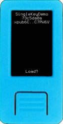
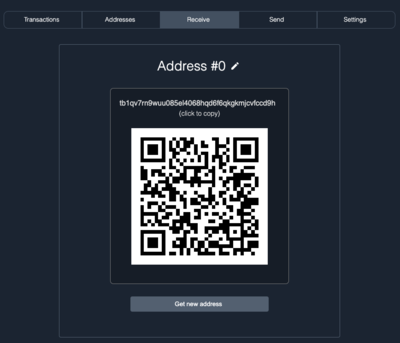
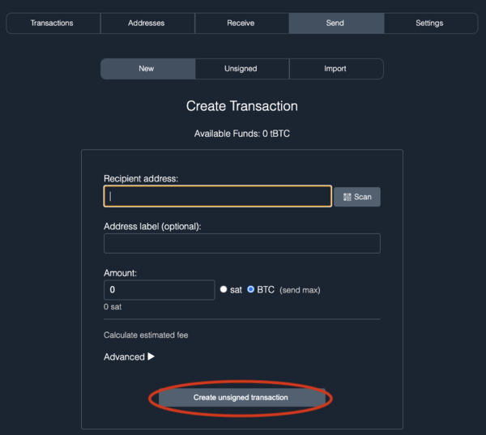
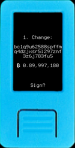
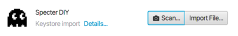
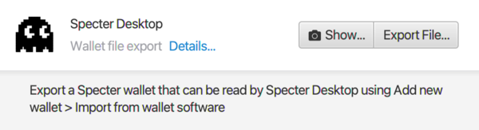
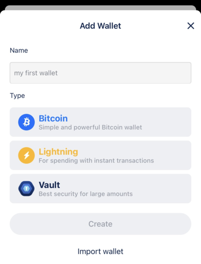
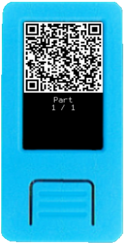
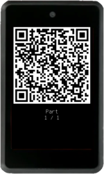

This guide assumes you have already created a mnemonic. If that is not the case, head over to the [Generating a Mnemonic](generating-a-mnemonic.md) page and complete those steps first.

When entering your mnemonic into Krux, make sure to select `Single-sig` before proceeding. The choice of `Single-sig` vs. `Multisig` at this point will change the derivation path used to generate your master extended public key (xpub) which will affect how wallet software handles it.

Selecting `Single-sig` will derive an xpub using the derivation path `m/84'/0'/0'` on mainnet and `m/84'/1'/0'` on testnet, which indicates to wallet software that a [Segregated Witness (Segwit) script type](https://github.com/bitcoin/bips/blob/master/bip-0084.mediawiki) should be used. For single-sig wallets, this script is `P2WPKH`, or just `wpkh`.

**Note:** The load of the `Wallet Descriptor` step is unnecessary for signing PSBTs with Single-sig wallets since the script type (`wpkh`) and key are already known. However, this can be useful if you wish to [print a backup](../features/printing.md) of the wallet or want an additional sanity check.

## Specter Desktop
### Create the wallet
In Specter Desktop, you will need to import your public key by adding a new device. Press the *Add new device* button on the left side of the app.

Krux is not listed as one of the available device types on the *Add Device* screen, so you will need to select the *Other* option.

You will be taken to the *Upload Keys* screen where you can choose to *Scan QR code*.

On your Krux, navigate to the *Extended Public Key* option under the main menu and show the **first** QR code to Specter Desktop.

It should import the xpub and display the *Purpose* as *#0 Single Sig (Segwit)*.

Give the device a name and press *Continue*. You should see the new device in the devices list on the left side of the app.

After you've added a device with your key to Specter Desktop, you can make a wallet using it. Press the *Add new wallet* button on the left side of the app.

Choose to create a *Single key wallet* when it asks which type of wallet you want on the following screen.

Select the device you just added.

Give your wallet a name and make sure to select *Segwit* for the wallet type, then press *Create wallet*.

Congrats, you just created a single-sig wallet with your key!

### Load the wallet into Krux
Load the wallet into Krux by going to the *Settings* page in Specter Desktop, then click the *Export* tab. There, press the *Export* button to display a QR code of your wallet.

In Krux, select the *Wallet* menu item option and scan the QR code.

If it worked, Krux should display the wallet information that it loaded:

### Receive coins
Navigate to the *Receive* screen where you should see a receive address that you can send funds to.

### Send coins
Go to *Send* in Specter Desktop, fill in the recipient address, amount, and any extra information you wish to supply, and click *Create unsigned transaction*.

You will now see a screen listing the devices in your wallet. Select the device you want to sign the transaction (PSBT) with.

Specter Desktop will display an animated QR code of the PSBT that you can scan with Krux by going to *Sign > PSBT* in its main menu. After scanning, Krux should display info about the transaction for you to confirm before signing.

Once you have confirmed, Krux will begin animating a QR code of the signed transaction that you can scan into Specter Desktop. 

In Specter Desktop, click *Scan signed transaction* and show it the QR. Each part of the QR code that is read will receive a ghost icon to indicate progress.

Once all parts of the QR code have been read, you should see a window popup asking you to broadcast the transaction. Click *Send transaction* and your transaction should be broadcasted to the network!

Congratulations, you have learned how to send a transaction using Specter Desktop 🎉

## Sparrow
### Create the wallet
In Sparrow, create a new wallet by going to *File > New Wallet* and give it a name.

On the wallet screen, make sure to select a *Single Signature* policy type with the *Native Segwit (P2WPKH)* script type.

Now, you will need to import your public key. To do so, press the *Airgapped Hardware Wallet* button under *Keystores*. On the screen that pops up, Krux is not listed as one of the available device types, so look for the *Specter DIY* option and click its *Scan...* button (You can also use the Jade, Keystone or Passport options available on Sparrow, they all have an animated QR code that is easy to be scanned by Krux).

On your Krux, navigate to the *Extended Public Key* option under the main menu and show the **first** QR code to Sparrow.

It should import the xpub and show a key under *Keystores* like the following:

If everything looks right, click the blue *Apply* button to create your wallet.

Congrats, you just created a single-sig wallet with your key!

## Load the wallet into Krux
Load the wallet into Krux by going back to the *Settings* page in Sparrow, then click the *Export...* button at the bottom of the screen and find *Specter Desktop* in the options list that pops up. Click its *Show...* button to display a QR code that you can import into Krux.

In Krux, select the *Wallet* menu item option and scan the QR code.

If it worked, Krux should display the wallet information that it loaded:

## Receive coins
Navigate to the *Receive* screen where you should see a receive address that you can send funds to.

## Send coins
Go to the *Send* screen, fill in the recipient address, amount, and any extra information you wish to supply, and click the blue *Create Transaction* button.

On the next screen, make sure that the *Signing Wallet* is the one you created and that the *Sighash* is set to *All*. Click the blue *Finalize Transaction for Signing* button.

On the next screen, click *Show QR* to make Sparrow display an animated QR code of the PSBT that you can scan with Krux by going to *Sign > PSBT* in its main menu.

After scanning, Krux should display info about the transaction for you to confirm before signing.

Once you have confirmed, Krux will begin animating a QR code of the signed transaction that you can scan into Sparrow. 

In Sparrow, click *Scan QR* and show it the QR. A progress bar will indicate how many parts of the QR have been read.

Once all parts of the QR code have been read, you should see the signature bar fill and two new buttons appear. Click the blue *Broadcast Transaction* button and your transaction should be broadcasted to the network!

Congratulations, you have learned how to send a transaction using Sparrow 🎉

## BlueWallet
### Create the wallet
In BlueWallet, create a new wallet by either pressing the *+* button or scrolling to the right until you see the *Add now* button.

On the screen that pops up, tap *Import wallet* to import your public key. 

On the following screen, tap *Scan or import a file* and it will begin trying to scan a QR code. 

On your Krux, navigate to the *Extended Public Key* option under the main menu and **make sure to show the second, zpub QR code** to BlueWallet.

It should import the key and create a watch-only wallet. From here, you can send or receive.

Congrats, you just created a single-sig wallet with your key!

## Load the wallet into Krux
Load the wallet into Krux by tapping the ellipsis in the top-right to see the wallet settings.

From here, tap *Export/Backup* in order to display a QR code of your wallet.

In Krux, select the *Wallet* menu item option and scan the QR code.

If it worked, Krux should display the wallet information that it loaded:

## Receive coins
Navigate to the *Receive* screen where you should see a receive address that you can send funds to.

Note that you can verify the receive address belongs to your wallet by using the [Scan Address](navigating-the-main-menu.md#scan-address) option.

## Send coins
Go to the *Send* screen, fill in the recipient address, amount, and any extra information you wish to supply, and tap *Next*.

You should see an animated QR code of the PSBT that you can scan with Krux by going to *Sign > PSBT* in its main menu.

After scanning, Krux should display info about the transaction for you to confirm before signing.

Once you have confirmed, Krux will begin animating a QR code of the signed transaction that you can scan into BlueWallet. 

Once all parts of the QR code have been read, you can then choose to broadcast the transaction, sending it to the network!

Congratulations, you have learned how to send a transaction using BlueWallet 🎉
