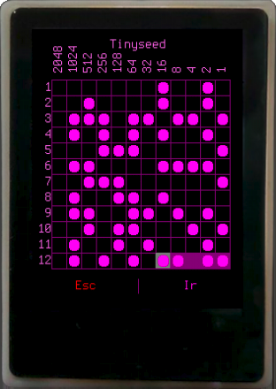
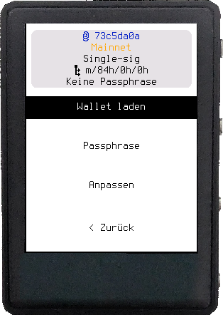
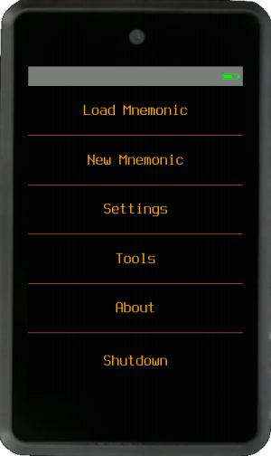
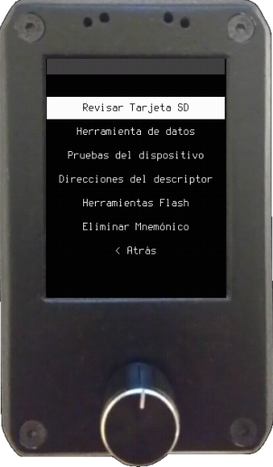
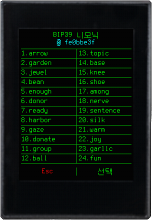

---
hide:
  - navigation
  - toc
---
# Krux

Krux is open-source firmware that runs on off-the-shelf Kendryte K210 devices, such as the Maix Amigo, M5StickV and [more](parts.md), turning them into bitcoin transaction signers. It adapts to devices with different form factors and includes tools to create and recover mnemonic backups, some of them with encryption options.

Devices like the Maix Amigo, Yahboom, WonderMV, TZT or Embed Fire come assembled and have touchscreens. Krux also runs on development board kits, which require assembly and, in some cases, soldering.

It interacts with wallet coordinators through QR codes, SD cards and thermal printers, keeping transactions and mnemonic backups in an offline environment.

Krux is a research and development project. Read the [disclaimer](getting-started/index.md#disclaimer) before using it.

To learn more about Krux, check out [Getting Started](getting-started/index.md).
