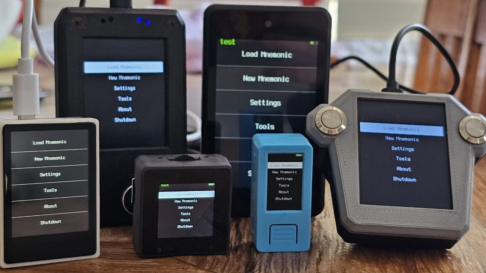

### Compatible Devices (comparative table)

| Device | [M5StickV](#m5stickv) | [Maix Amigo](#maix-amigo) | [Maix Dock](#maix-dock) | [Yahboom k210 module](#yahboom-k210-module) | [Maix Cube](#maix-cube) | [WonderMV](#wondermv) | [TZT](#tzt) | [Embed Fire](#embed-fire) |
| ------------- | ------------- | ------------- | ------------- | ------------- | ------------- | ------------- | ------------- | ------------- |
| Price range | US$ 50-55 | US$ 50-85 | US$ 27-35  | US$ 45-61 | US$ 34-49 | US$ 58-86 | US$ 48 | US$ 74 |
| Screen size /  Res. px /  PPI | 1.14" /  135 x 240 /  241 | 3.5" /  320 x 480 /  165 | 2.4" /  240 x 320 /  167 | 2" /  240 x 320 /  200 | 1.3" /  240 x 240 /  261 | 2" /  240 x 320 /  200| 2" /  240 x 320 /  200 | 2.4" /  240 x 320 /  167 |
| Brightness control | :white_check_mark: | :x: | :x: | :x: | :white_check_mark: | :white_check_mark: | :x: | :x: |
| Device size | 48 x 24 x 22mm | 104 x 63 x 17mm | 98 x 59 x 18mm | 57 x 41 x 17mm | 40 x 40 x 16mm | 59 x 41 x 17mm | 57 x 41 x 16mm | 63 x 45 x 14mm |
| Touchscreen | :x: | Capacitive | :x: | Capacitive | :x: | Capacitive | Capacitive | Capacitive |
| Camera | `OV7740` | `OV7740` rear / `GC0328` front | `GC0328` | `OV2640` <i style="font-size: 85%">(VER:1.0)</i> or `GC2145` <i style="font-size: 85%">(VER:1.1)</i> | `OV7740` | `GC2145` | `GC2145` or `GC0328` | `OV2640` or `GC2145` |
| Battery  | 200mAh | 520mAh | :x: | :x: | 200mAh | :x: | :x: | :x: |
| Requirements | None | None | [Rotary encoder](https://duckduckgo.com/?q=ky-040)  [3D printed case](https://github.com/selfcustody/DockEncoderCase)  Soldering Assembly | None | None | None | None | None |
| Warnings  | [:material-numeric-1-circle:{ title="USB-C recognition" }](#pull-up-resistor-info) | [:material-numeric-2-circle:{ title="Maix Amigo screens" }](#amigo-info) | [:material-numeric-3-circle:{ title="Maix Dock and soldered pin" }](#dock-info) | Micro USB | 3-Way button | [:material-numeric-1-circle:{ title="USB-C recognition" }](#pull-up-resistor-info) [:material-numeric-4-circle:{ title="WonderMV and SD card" }](#wondermv-info) | None | [:material-numeric-5-circle:{ title="Embed Fire loose touchscreen" }](#embedfire-info) |

<i style="font-size: 85%">:material-numeric-1-circle:{id="pull-up-resistor-info"}:
----8<----
usb-c-pull-up-resistor.en.txt
----8<----
</i>

<i style="font-size: 85%">:material-numeric-2-circle:{id="amigo-info"}:
----8<----
amigo-more-info-faq.en.txt:2
----8<----
</i>

<i style="font-size: 85%">:material-numeric-3-circle:{id="dock-info"}:
Some Maix Dock units are shipped with soldered pin connectors, which prevent them from fitting into the [3D-printed case](https://github.com/selfcustody/DockEncoderCase). Certain boards also come with built-in Wi-Fi. 
</i>

<i style="font-size: 85%">:material-numeric-4-circle:{id="wondermv-info"}:
WonderMV may restart when certain SD cards are inserted. See [Why does my WonderMV reboot](troubleshooting.md/#why-does-my-wondermv-reboot-when-i-insert-an-sd-card).
</i>

<i style="font-size: 85%">:material-numeric-5-circle:{id="embedfire-info"}:
Embed Fire touchscreen may shift slightly within the case when pressed. Some units does't support high baudrate for flash.
</i>

<i style="font-size: 85%">**All devices feature Kendryte K210 chip:**
28nm process, dual-core RISC-V 64bit @400MHz, 8 MB high-speed SRAM, DVP camera and MCU LCD interface, AES Accelerator, SHA256 Accelerator, FFT Accelerator.
</i>

### M5StickV

Krux was first ported to this device in March 2022. Featuring the smallest screen size and resolution, it also includes a built-in battery. Refer to the [USB-C recognition warning <i style="font-size: 85%">:material-numeric-1-circle:{ title="USB-C recognition" }](#pull-up-resistor-info)</i> above for important notes. Below is a list of distributors where it can be found:

- [M5Stack](https://shop.m5stack.com/products/stickv)
- [Mouser](https://www.mouser.com/c/?q=m5stickv)
- [Digi-Key](https://www.digikey.com/en/products/detail/m5stack-technology-co-ltd/K027/10492135)
- [Electromaker](https://www.electromaker.io/shop/product/m5stickv-k210-ai-camera-without-wifi)
- [Lee's Electronic](https://leeselectronic.com/en/product/169940-m5stick-ai-camera-kendryte-k210-risc-v-core-no-wifi.html)
- [AliExpress](https://www.aliexpress.com/w/wholesale-stickv-k210.html)
- [Alibaba](https://www.alibaba.com/trade/search?SearchText=stickv+k210)
- [ABRA](https://abra-electronics.com/sensors/cameras/m5stickv-k210-ai-camera-ideal-for-machine-vision.html)
- [Adafruit](https://www.adafruit.com/product/4321)
- [Cytron](https://www.cytron.io/c-development-tools/c-fpga/p-m5stickv-k210-ai-camera-without-wifi)

### Maix Amigo

Krux has supported this device since its second version in August 2022. It offers the largest screen size and resolution, a touchscreen, and a built-in battery. Below is a list of distributors where it is available:

- [AliExpress](https://www.aliexpress.com/w/wholesale-sipeed-amigo.html)
- [Seeed Studio](https://www.seeedstudio.com/Sipeed-Maix-Amigo-p-4689.html)
- [Digi-Key](https://www.digikey.com/en/products/detail/seeed-technology-co-ltd/102110463/13168813)
- [Mouser](https://www.mouser.com/c/?q=sipeed)
- [Electromaker](https://www.electromaker.io/shop/search/sipeed)
- [スイッチサイエンス](https://www.switch-science.com/search?q=maix+amigo)

### Yahboom k210 module

Supported by Krux since March 2024, this device features a touchscreen and comes with a compatible 32 GB card, a USB card reader, one PH2.0 4-pin male-to-male connector, and a PH2.0 female adapter for connecting to a [thermal printer](#optional-ttl-serial-thermal-printer). Below is a list of distributors where it is available:

- [AliExpress](https://www.aliexpress.com/w/wholesale-yahboom-k210-module.html)
- [Amazon](https://www.amazon.com/s?k=Yahboom+k210+module)
- [Yahboom Store](https://category.yahboom.net/collections/mb-module/products/k210-module)
- [ETC HK Shop](https://www.etchkshop.com/products/k210-module-ai-camera)

### Maix Cube

Supported by Krux since July 2024, this device features the second smallest screen size and resolution, a 3-way button, and a built-in battery. Below is a list of distributors where it is available:

- [Seeed Studio](https://www.seeedstudio.com/Sipeed-Maix-Cube-p-4553.html)
- [Mouser](https://www.mouser.com/c/?q=sipeed)
- [Electromaker](https://www.electromaker.io/shop/search/sipeed)
- [Digi-Key](https://www.digikey.com.br/en/products/filter/embedded-mcu-dsp-evaluation-boards/786?s=N4IgTCBcDaIM4EsAOBTFATEBdAvkA)
- [AliExpress](https://www.aliexpress.com/w/wholesale-sipeed-cube.html)
- [Amazon](https://www.amazon.com/s?k=k210+cube)

### WonderMV

Supported by Krux since September 2024, this touchscreen device features a metal backplate and includes a compatible 32 GB card, a USB card reader, and two 5264 4-pin connector male-to-male cables for connecting to a [thermal printer](#optional-ttl-serial-thermal-printer). Refer to the [USB-C recognition warning <i style="font-size: 85%">:material-numeric-1-circle:{ title="USB-C recognition" }](#pull-up-resistor-info)</i> and the [SD card warning <i style="font-size: 85%">:material-numeric-4-circle:{ title="WonderMV and SD card" }](#wondermv-info)</i> above for important notes. The following distributors offer this device:

- [AliExpress](https://www.aliexpress.com/w/wholesale-k210-wondermv.html)
- [Amazon](https://www.amazon.com/s?k=k210+WonderMV)
- [Hiwonder Store](https://www.hiwonder.com/products/wondermv)
- [Ruten](https://www.ruten.com.tw/item/show?22351444721094)
- [飆機器人](https://shop.playrobot.com/products/veo0116)

### TZT

Supported by Krux since October 2025, this touchscreen device comes in a premium milled aluminum housing and features five buttons. Available through the following distributors:

- [AliExpress](https://www.aliexpress.com/w/wholesale-tzt-canmv-k210.html)

### Embed Fire

Supported by Krux since November 2025, this touchscreen device features a 2.4" display, a metal backplate and also cables for connecting to a [thermal printer](#optional-ttl-serial-thermal-printer). It is available through the following distributors:

- [AliExpress](https://www.aliexpress.com/w/wholesale-k210-AI-python.html)

### Maix Dock

For DIY enthusiasts, Krux has supported the Maix Dock since August 2022. These kits include a board and screen but require you to source a rotary encoder or buttons separately and assemble the device yourself. Some Maix Dock boards also include Wi-Fi.

Here are example builds with instructions on how to recreate them:

- [https://github.com/selfcustody/DockEncoderCase](https://github.com/selfcustody/DockEncoderCase)

Available from these distributors:

- [Mouser](https://www.mouser.com/c/?q=sipeed)
- [Electromaker](https://www.electromaker.io/shop/search/sipeed)
- [Digi-Key](https://www.digikey.com.br/en/products/filter/embedded-mcu-dsp-evaluation-boards/786?s=N4IgTCBcDaIM4EsAOBTFATEBdAvkA)
- [AliExpress](https://www.aliexpress.com/w/wholesale-sipeed-maix.html)
- [Amazon](https://www.amazon.com/s?k=sipeed+k210)

## Other Parts
### USB-C or Micro USB Charge Cable
This will come with the device. It will be necessary to power, charge the device (if it has battery) and to initially flash the firmware.

### (Optional) MicroSD Card
----8<----
sd-card-info-faq.en.txt
----8<----
Yahboom will come with a compatible 32G card. The size of the SD card isn't important; anything over a few megabytes will be plenty.

### (Optional) TTL Serial Thermal Printer
----8<----
warning-printer.en.txt
----8<----

Krux has the capability to print all QR codes it generates, including those for mnemonics, xpubs, wallet backups, and signed PSBTs, using a locally-connected thermal printer via its serial port.

Many TTL serial thermal printers may be compatible, but currently, the [Goojprt QR203](https://www.aliexpress.com/w/wholesale-Goojprt-QR203.html) has the best support (except this printer only supports ASCII or Chinese characters, non-ASCII characters will be printed as Chinese). The [Adafruit printer starter pack](https://www.adafruit.com/product/600) can also be a convenient option to get started, as it includes all the necessary components for printing (except the conversion cable). To ensure proper functionality, enable the printer driver in [settings](getting-started/settings.md/#thermal), set the Tx pin and baud rate value to either 19200 or 9600 (depends on the printer), as explained in this [Adafruit printer tutorial](https://learn.adafruit.com/mini-thermal-receipt-printer/first-test). You will need to connect the device's Tx to the printer's Rx and device's ground to the printer's ground, do not connect any other pins because a wrong connection may damage your device. The printer requires a dedicated power supply, typically with an output of 5 to 9V (or 12V) and capable of supplying at least 2A. For more information, [see this discussion](https://github.com/selfcustody/krux/discussions/312).

#### Conversion Cable
To connect the printer to M5StickV, Amigo or Cube, you will need a [grove conversion cable](https://store-usa.arduino.cc/products/grove-4-pin-male-to-grove-4-pin-cable-5-pcs) with a 4-pin male Grove connector on one end (to connect to the device) and 4-pin male jumpers on the other end (to connect to the printer). Check your device and printer model connection first, Yahboom comes with PH2.0 4Pin female connector; Dock doesn't have a connector; WonderMV comes with [Molex 51004 4-pin connector](https://www.digikey.ca/en/products/detail/molex/0530150410/1785079) (used with smart servo). For a more reliable connection, it is recommended to cut and solder the wires of your custom cables instead of using jumpers. Here we have a description of some [inter-integrated circuit (I2C) connector standards](https://www.cable-tester.com/i2c-pin-out/).