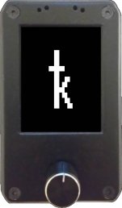

### Compatible Devices (comparative table)

| Device | M5StickV | Maix Amigo | Maix Dock | Maix Bit | Yahboom k210 module | Maix Cube | WonderMV |
| ------------- | ------------- | ------------- | ------------- | ------------- | ------------- | ------------- | ------------- |
| Price range | US$ 50-55 | US$ 50-85 | US$ 27-35  | US$ 32-42 | US$ 45-61 | US$ 34-49 | US$ 58-86 |
| Screen size / resolution | 1.14" / 135*240 | 3.5" / 320*480 | 2.4" / 240*320 | 2.4" / 240*320 | 2" / 240*320 | 1.3" / 240*240 | 2" / 240*320 |
| Brightness control | :white_check_mark: | :x: | :x: | :x: | :x: | :white_check_mark: | :white_check_mark: |
| Device size | 48\*24\*22mm | 104\*63\*17mm | 98\*59\*18mm | 69\*84\*41mm | 57\*41\*17mm | 40\*40\*16mm | 59\*41\*17mm |
| Touchscreen  | :x: | Capacitive | :x: | :x: | Capacitive | :x: | Capacitive |
| Camera [:material-information:{ title="Anti-glare mode" }](#camera-info)  | `OV7740` | `OV7740` rear `GC0328` front | `GC0328` | `OV2640` or `OV5642` | `OV2640` <i style="font-size: 85%">(VER:1.0)</i> or `GC2145` <i style="font-size: 85%">(VER:1.1)</i> | `OV7740` | `GC2145` |
| Battery  | 200mAh | 520mAh | :x: | :x: | :x: | 200mAh | :x: |
| Requirements | None | None | [Rotary encoder](https://duckduckgo.com/?q=ky-040)  [3D printed case](https://github.com/selfcustody/DockEncoderCase)  Soldering Assembly | Buttons  [3D printed case](https://github.com/selfcustody/MaixBitCase)  Soldering Assembly | None | None | None |
| Warnings  | [:material-numeric-1-circle:{ title="M5StickV and USB-C" }](#m5stickv-info) | [:material-numeric-2-circle:{ title="Maix Amigo screens" }](#amigo-info) | [:material-numeric-3-circle:{ title="Maix Dock and soldered pin" }](#dock-info) | Camera has  lens distortion | Micro USB | 3-Way button | None |

<i style="font-size: 85%">:material-information:{id="camera-info"}:
Only `OV7740`, `OV2640` and `GC2145` have an anti-glare mode to better capture images from high brightness screens or with incident light.
</i>

<i style="font-size: 85%">:material-numeric-1-circle:{id="m5stickv-info"}:
----8<----
m5stickv-usb-c.en.txt
----8<----
</i>

<i style="font-size: 85%">:material-numeric-2-circle:{id="amigo-info"}:
----8<----
amigo-more-info-faq.en.txt:2
----8<----
</i>

<i style="font-size: 85%">:material-numeric-3-circle:{id="dock-info"}:
Some stores ship the Maix Dock with soldered pin connectors that do not fit into the [3D printed case](https://github.com/selfcustody/DockEncoderCase).
</i>

<i style="font-size: 85%">**All devices feature Kendryte K210 chip:**
28nm process, dual-core RISC-V 64bit @400MHz, 8 MB high-speed SRAM, DVP camera and MCU LCD interface, AES Accelerator, SHA256 Accelerator, FFT Accelerator.
</i>

### M5StickV

Below is a list of some distributors where you can find this device:

- [M5Stack](https://shop.m5stack.com/products/stickv)
- [Mouser](https://www.mouser.com/c/?q=m5stickv)
- [Digi-Key](https://www.digikey.com/en/products/detail/m5stack-technology-co-ltd/K027/10492135)
- [Electromaker](https://www.electromaker.io/shop/product/m5stickv-k210-ai-camera-without-wifi)
- [Lee's Electronic](https://leeselectronic.com/en/product/169940-m5stick-ai-camera-kendryte-k210-risc-v-core-no-wifi.html)
- [AliExpress](https://www.aliexpress.com/w/wholesale-m5stickv.html)
- [ABRA](https://abra-electronics.com/sensors/cameras/m5stickv-k210-ai-camera-ideal-for-machine-vision.html)
- [Adafruit](https://www.adafruit.com/product/4321)
- [Cytron](https://www.cytron.io/c-development-tools/c-fpga/p-m5stickv-k210-ai-camera-without-wifi)

### Maix Amigo

Below is a list of some distributors where you can find this device:

- [AliExpress](https://www.aliexpress.com/w/wholesale-sipeed-amigo.html)
- [Seeed Studio](https://www.seeedstudio.com/Sipeed-Maix-Amigo-p-4689.html)
- [Digi-Key](https://www.digikey.com/en/products/detail/seeed-technology-co-ltd/102110463/13168813)
- [Mouser](https://www.mouser.com/c/?q=sipeed)
- [Electromaker](https://www.electromaker.io/shop/search/sipeed)

### Yahboom k210 module

It comes with a compatible 32G card, an USB card reader, one PH2.0 4Pin male-to-male connector and one PH2.0 female adapter (to connect to a [thermal printer](#optional-ttl-serial-thermal-printer)). Below is a list of some distributors where you can find this device:

- [AliExpress](https://www.aliexpress.com/w/wholesale-yahboom-k210-module.html)
- [Amazon](https://www.amazon.com/s?k=Yahboom+k210+module)
- [Yahboom Store](https://category.yahboom.net/collections/mb-module/products/k210-module)
- [ETC HK Shop](https://www.etchkshop.com/products/k210-module-ai-camera)

### Maix Cube

Below is a list of some distributors where you can find this device:

- [Seeed Studio](https://www.seeedstudio.com/Sipeed-Maix-Cube-p-4553.html)
- [Mouser](https://www.mouser.com/c/?q=sipeed)
- [Electromaker](https://www.electromaker.io/shop/search/sipeed)
- [Digi-Key](https://www.digikey.com.br/en/products/filter/embedded-mcu-dsp-evaluation-boards/786?s=N4IgTCBcDaIM4EsAOBTFATEBdAvkA)
- [AliExpress](https://www.aliexpress.com/w/wholesale-sipeed-cube.html)
- [Amazon](https://www.amazon.com/s?k=k210+cube)

### WonderMV

It comes with a compatible 32G card, an USB card reader, and two Molex 51004 4-pin male-to-male cable (to connect to a [thermal printer](#optional-ttl-serial-thermal-printer)). Below is a list of some distributors where you can find this device:

- [AliExpress](https://www.aliexpress.com/w/wholesale-k210-wondermv.html)
- [Amazon](https://www.amazon.com/s?k=k210+WonderMV)
- [Hiwonder Store](https://www.hiwonder.com/products/wondermv)
- [Ruten](https://www.ruten.com.tw/item/show?22351444721094)
- [飆機器人](https://shop.playrobot.com/products/veo0116)

### Maix Dock and Maix Bit

For the DIYers, the Maix Dock and Maix Bit are also supported but will require sourcing the parts individually and building the device yourself.

Below are example implementations with instructions on how to recreate them:

- [https://github.com/selfcustody/DockEncoderCase](https://github.com/selfcustody/DockEncoderCase)
- [https://github.com/selfcustody/MaixBitCase](https://github.com/selfcustody/MaixBitCase)

Below is a list of some distributors where you can find these devices:

- [Mouser](https://www.mouser.com/c/?q=sipeed)
- [Electromaker](https://www.electromaker.io/shop/search/sipeed)
- [Digi-Key](https://www.digikey.com.br/en/products/filter/embedded-mcu-dsp-evaluation-boards/786?s=N4IgTCBcDaIM4EsAOBTFATEBdAvkA)
- [AliExpress](https://www.aliexpress.com/w/wholesale-sipeed-maix.html)
- [Amazon](https://www.amazon.com/s?k=sipeed+k210)

## Other Parts
### USB-C or Micro USB Charge Cable
This will come with the device. It will be necessary to power, charge the device (if it has battery) and to initially flash the firmware.

### (Optional) MicroSD Card
----8<----
sd-card-info-faq.en.txt
----8<----
Yahboom will come with a compatible 32G card. The size of the SD card isn't important; anything over a few megabytes will be plenty.

### (Optional) TTL Serial Thermal Printer
----8<----
warning-printer.en.txt
----8<----

Krux has the capability to print all QR codes it generates, including those for mnemonics, xpubs, wallet backups, and signed PSBTs, using a locally-connected thermal printer via its serial port.

Many TTL serial thermal printers may be compatible, but currently, the [Goojprt QR203](https://www.aliexpress.com/w/wholesale-Goojprt-QR203.html) has the best support (except this printer only supports ASCII or Chinese characters, non-ASCII characters will be printed as Chinese). The [Adafruit printer starter pack](https://www.adafruit.com/product/600) can also be a convenient option to get started, as it includes all the necessary components for printing (except the conversion cable). To ensure proper functionality, enable the printer driver in the [Krux settings](./getting-started/settings.md/#thermal), set the Tx pin and baud rate value to either 19200 or 9600 (depends on the printer), as explained in this [Adafruit printer tutorial](https://learn.adafruit.com/mini-thermal-receipt-printer/first-test). You will need to connect the device's Tx to the printer's Rx and device's ground to the printer's ground, do not connect any other pins because a wrong connection may damage your device. The printer requires a dedicated power supply, typically with an output of 5 to 9V (or 12V) and capable of supplying at least 2A. For more information, [see this discussion](https://github.com/selfcustody/krux/discussions/312).

#### (Optional) Conversion Cable for Thermal Printer
To connect the printer to M5StickV, Amigo or Cube, you will need a [grove conversion cable](https://store-usa.arduino.cc/products/grove-4-pin-male-to-grove-4-pin-cable-5-pcs) with a 4-pin male Grove connector on one end (to connect to the device) and 4-pin male jumpers on the other end (to connect to the printer). Check your device and printer model connection first, Yahboom comes with PH2.0 4Pin female connector; Dock and Bit doesn't have a connector; WonderMV comes with [Molex 51004 4-pin connector](https://www.digikey.ca/en/products/detail/molex/0530150410/1785079) (used with smart servo). For a more reliable connection, it is recommended to cut and solder the wires of your custom cables instead of using jumpers. Here we have a description of some [inter-integrated circuit (I2C) connector standards](https://www.cable-tester.com/i2c-pin-out/).