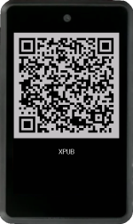

Now, you will need to import your public key. To do so, press the *Airgapped Hardware Wallet* button under *Keystores* section. On the screen that pops up, look for *Krux* option and click its :camera: *Scan...* button.

On your Krux device, navigate to the *Extended Public Key* option in the main menu and click on **XPUB - QR Code**  and show it to Sparrow.

It should import the xpub and show a key tab under *Keystores* section: