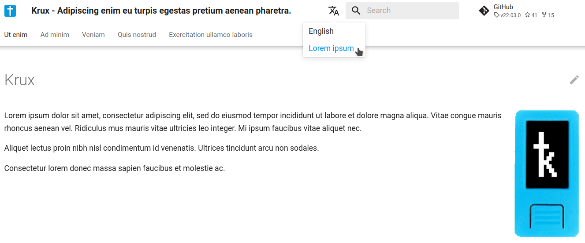

# Translation

Translations can be done for:

- UI: see `i18n/translations`
- Documentation: `i18n/README.md`

## UI

Add a file in format `xy-WZ.json` in [translations](./translations), where `xy` is a locale (like `en`, `es` or `pt`), and `WZ` is country (like `US`, `MX` or `BR`).

## Documentation

### Install dependencies

Execute:

```bash
poetry install --extras docs
```

### Configure translation

Open `mkdocs.yml` and edit the `plugins` section with the following premises:

- choose the locale "extension" (like `en`, `es` or `pt`);
- add entries to `plugins.i18n.languages` in [mkdocs.yml](../mkdocs.yml);
- add entries to `plugins.i18n.nav_translations` in[mkdocs.yml](../mkdocs.yml);
- create sibling files, corresponding to files ending with `en.md`, in the same folders they are in, with the extension you chose;
- translate the contents of files.

### Example

Suppose you translated to a fake locale [Lorem ipsum](https://pt.wikipedia.org/wiki/Lorem_ipsum). So, you can call the locale extension as `lo`. Now, you will add the following `lo` entries to `plugins.i18n.languages` in [mkdocs.yml](../mkdocs.yml):

- name: name of the language that will be shown in the web interface
- site_name: translated website title

```yaml
plugins:
  ...
  - i18n:
    default_language: en
    languages:
      en: English
      lo:
        name: Lorem ipsum
        site_name: Krux - Adipiscing enim eu turpis egestas pretium aenean pharetra.
```

Now, you will add the following `lo` entries to `plugins.i18n.nav_translations` in [mkdocs.yml](../mkdocs.yml). These entries are the equivalent of those shown in the menus.

- Home: `translation`;
- Getting Started: `translation`;
- Devices and Part List: `translation`;
- FAQ: `translation`;
- Support the Project: `translation`;
- About: `translation`;
- Installing: `translation`;
- Generating a Mnemonic: `translation`;
- Loading a Mnemonic: `translation`;
- Navigating the Main Menu: `translation`;
- Using a Single-sig Wallet: `translation`;
- Using a Multisig Wallet: `translation`; 
- Printing: `translation`;
- Settings: `translation`;

```yaml
plugins:
  ...
  - i18n:
    ...
    nav_translations:
      # [... other translation ...]
      lo:
        Home: Ut enim
        Getting Started: Ad minim
        Devices and Part List: Veniam
        FAQ: Quis nostrud 
        Support the Project: Exercitation ullamco laboris
        About: Nisi
        Installing: Ut aliquip 
        Generating a Mnemonic: Ex ea
        Loading a Mnemonic: Consequat
        Navigating the Main Menu: Duis aute irure dolor
        Using a Single-sig Wallet: In reprehenderit in voluptate
        Using a Multisig Wallet: Velit esse cillum dolore 
        Printing: Eu fugiat
        Settings: Nulla pariatur
      # [... other translation ...]
```

Now you can start translating the pages. The original ones are defined in `nav` section at [mkdocs](../mkdocs.yml). The format will be `<name>.<locale>.md`. It is important to note that:

- must be located in the same folder as the `en` file.
- must have the same name;
- must have a locale other than `en`;
- must end with `md`;

For example, let's check the structure of the original files:

```yaml
# ..configurations...
nav:
  - Home: index.en.md
  - Getting Started:
    - About: getting-started/index.en.md
    - Installing: getting-started/installing.en.md
    - Generating a Mnemonic: getting-started/generating-a-mnemonic.en.md
    - Loading a Mnemonic: getting-started/loading-a-mnemonic.en.md
    - Navigating the Main Menu: getting-started/navigating-the-main-menu.en.md
    - Using a Single-sig Wallet: getting-started/using-a-single-sig-wallet.en.md
    - Using a Multisig Wallet: getting-started/using-a-multisig-wallet.en.md
    - Printing: getting-started/printing.en.md
    - Settings: getting-started/settings.en.md
  - Devices and Part List: parts.en.md
  - FAQ: faq.en.md
  - Support the Project: support.en.md
# ..configurations...
```

Let's start with the `Home` page, which is written in the file [index.en.md](index.en.md). First, create a copy:

```bash
$> cp docs/index.en.md docs/index.lo.md
```

Now open the created file and translate it, always remembering to keep the reading structure:

```markdown
---
hide:
  - navigation
  - toc
---
# Krux


Lorem ipsum dolor sit amet, consectetur adipiscing elit, sed do eiusmod tempor incididunt ut labore et dolore magna aliqua. Vitae congue mauris rhoncus aenean vel. Ridiculus mus mauris vitae ultricies leo integer. Mi ipsum faucibus vitae aliquet nec.

Aliquet lectus proin nibh nisl condimentum id venenatis. Ultrices tincidunt arcu non sodales. 

Consectetur lorem donec massa sapien faucibus et molestie ac.
```

Now you can execute the docs server to check your change:

```bash-
$> mkdocs serve
INFO     -  Building documentation...
WARNING  -  Language 'lo' is not supported by lunr.js, not setting it in the 'plugins.search.lang' option
INFO     -  Cleaning site directory
INFO     -  The following pages exist in the docs directory, but are not included in the "nav" configuration:
              - getting-started/installing-from-source.en.md
INFO     -  The following pages exist in the docs directory, but are not included in the "nav" configuration:
              - getting-started/installing-from-source.en.md
INFO     -  The following pages exist in the docs directory, but are not included in the "nav" configuration:
              - getting-started/installing-from-source.en.md
INFO     -  Translated navigation to lo
INFO     -  Building en documentation
INFO     -  Building lo documentation
WARNING  -  Language lo is not supported by mkdocs-material==8.3.9, not setting the 'theme.language' option
INFO     -  Documentation built in 1.30 seconds
INFO     -  [21:05:37] Watching paths for changes: 'docs', 'mkdocs.yml'
INFO     -  [21:05:37] Serving on http://127.0.0.1:8000/krux/
INFO     -  [21:05:40] Browser connected: http://localhost:8000/krux/lo/
```

And you will see an icon next to the search field where you can select your translation:

<p align="center">

</p>

If its ok, you can make your PR.