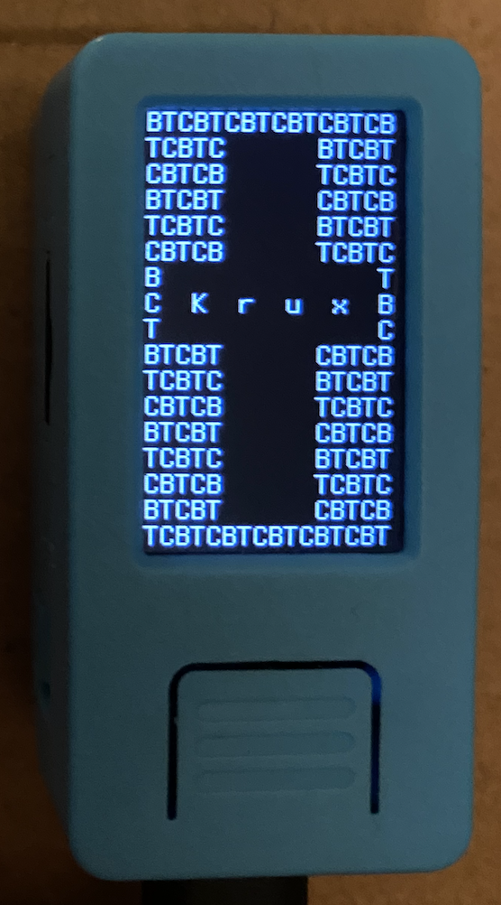

For now, Krux must be built from source. In the future, we will make PGP-signed releases available for download.

### Requirements
#### Hardware
You will need the M5StickV, a [supported microSD card](https://github.com/m5stack/m5-docs/blob/master/docs/en/core/m5stickv.md#tf-cardmicrosd-test), a USB-C cable, and a computer with a USB port to continue. Consult the [part list](../../parts) for more information.

#### Software
You will need a computer with [`git`](https://git-scm.com/book/en/v2/Getting-Started-Installing-Git) and [`vagrant`](https://www.vagrantup.com/downloads) installed.

### Fetch the code
In a terminal, run the following:
```bash
git clone --recurse-submodules https://github.com/jreesun/krux
```
This will pull down the Krux source code as well as the code for all its dependencies and put them inside a new `krux` folder.

Note: When you wish to pull down updates to this repo, you can run the following inside the `krux` folder:
```bash
git pull origin main && git submodule update --recursive
```

### Spin up a virtual machine
After you have installed Vagrant, run the following inside the `krux` folder to spin up a new VM:
```bash
vagrant up
```

### Setup the devtools
Before you build the firmware for the first time, you will need to run the setup script to install tools necessary for signing builds:
```bash
vagrant ssh -c 'cd /vagrant; ./krux setup'
```

### Build the firmware
Run the following:
```bash
vagrant ssh -c 'cd /vagrant; ./krux build 1.0.0 en-US'
```

Replace `1.0.0` with the version you want to tag the build with.

Prefer a different language? You can replace `en-US` in the command above with one of the following supported locales:

- de-DE (German)
- es-MX (Spanish)
- fr-FR (French)
- vi-VN (Vietnamese)
- Are we missing one? Make a PR!

When you run the command, you will be prompted to supply a `Signer Private Key`. If you don't have one, you can leave it blank and hit enter to have one generated for you. This key is used to sign the firmware.

At this point, you can go brew a coffee because it will take a while to complete.

If all goes well, you should see three new files appear in the `krux` directory:

1. `firmware-v1.0.0.bin`
2. `firmware-v1.0.0.bin.sha256.txt`
3. `firmware-v1.0.0.bin.sig`

The first file is the firmware that will be installed on the device, the second file is the sha256 hash of the firmware, and the third file is your signature of the sha256 hash verifying that you generated the build.

### Flash the firmware onto the M5StickV
Connect the M5StickV to your computer via USB, power it on (left-side button), and run the following:
```bash
vagrant reload && vagrant ssh -c 'cd /vagrant; ./krux flash'
```
Note: `vagrant reload` is necessary in order for the newly-inserted USB device to be detected and passed through to the VM on startup.

If this command fails with the error `Failed to find device via USB. Is it connected and powered on?`, make sure that your user has been added to the `vboxusers` group. On Mac or Linux, run the following command:

```bash
sudo usermod -a -G vboxusers <user>
```

If the flashing process fails midway through, check the connection, restart the device, and try the command again.

If everything worked, you should see...



If after 30 seconds you still see a black screen, try power cycling the device by holding down the power button for six seconds.

Congrats, you're now running Krux!

### Upgrade via microSD card
Once you've installed the initial firmware on your device via USB, you can either continue updating the device by flashing or you can perform upgrades via microSD card to keep the device airgapped.

To perform an upgrade, simply copy the `firmware-v1.0.0.bin` and `firmware-v1.0.0.bin.sig` files to the root of a FAT-32 formatted microSD card, insert the card into your M5StickV, and reboot the device. If it detects the new firmware file and is able to verify that the signature was generated by you, you will be prompted to install it.
