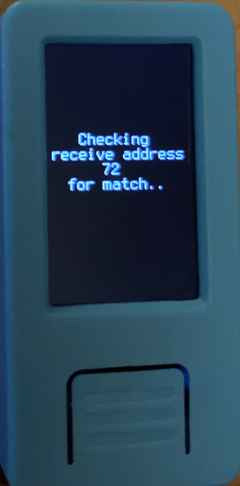

After entering your mnemonic, you will find yourself on Krux's main menu.

Below is a breakdown of the options:

### Mnemonic

This option allows you to view your mnemonic words and, if you have a thermal printer attached, print out the mnemonic as a QR code. The data in this code will be a plaintext space-separated string of the (English) words. This QR code can then be read by Krux for faster loads in the future.

    

### Public Key (xpub)

This option displays your master extended public key (xpub) as text as well as a QR code. The QR code is in plaintext format and additionally includes derivation information (in BTC core format) that coordinator wallet software can use to determine whether it supports single-key or multisig wallets.

After the xpub, a zpub or Zpub is shown depending on if a single-key or multisig wallet was chosen. This z/Zpub is usually not necessary unless you are using Electrum.

If a thermal printer is attached, you can print either QR code.

 

### Wallet

When you first select this option, you will be prompted to load a wallet. At this point, the camera will turn on and you will need to scan a wallet backup QR code from your wallet coordinator software. If scanned successfully, you will see a preview of the wallet to confirm.

If you return to this option after having loaded your wallet, you will see the wallet's name and the xpubs of all cosigners along with a QR code containing the same exact data that was loaded. If you have a thermal printer attached, you can print this QR code.  

Note that you can't change the wallet once one has been loaded. To do this, you will need to restart the device.

 

### Check Address

This option turns on the camera and allows you to scan in a QR code of a receive address. If the address can be derived by your wallet, you will see it turn green, otherwise it will exhaustively search through as many addresses as you want until you choose to stop. After stopping, the address will be shown in red to indicate it could not be derived.

This option exists as an extra security check to verify that the address your wallet coordinator has generated is authentic and belongs to your wallet.

 

### Sign PSBT

This option turns on the camera and allows you to scan an animated QR code of a PSBT generated by your wallet coordinator software. Upon scanning, you will be shown a preview of how much BTC is being sent, who is receiving it, and the fee that is being paid.

If you confirm, a signed PSBT will be generated and an animated QR code will be displayed that you can use to import the signed PSBT back into your wallet coordinator software. If a thermal printer is attached, you can also print the QR codes.
